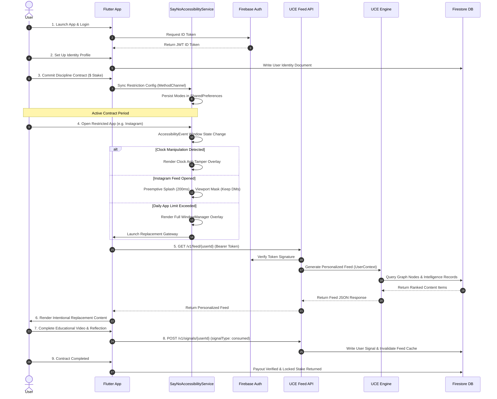
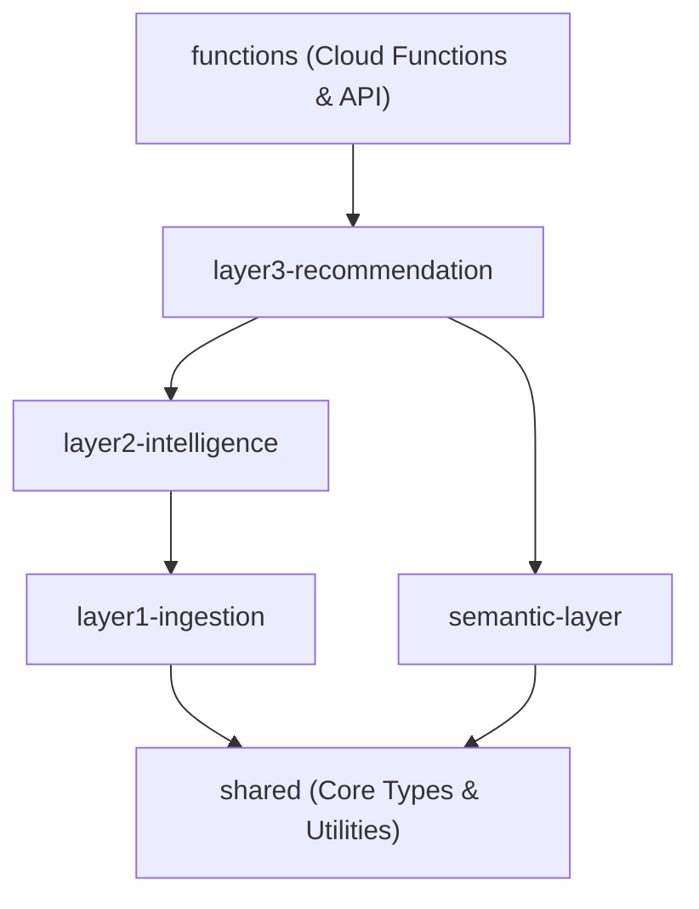
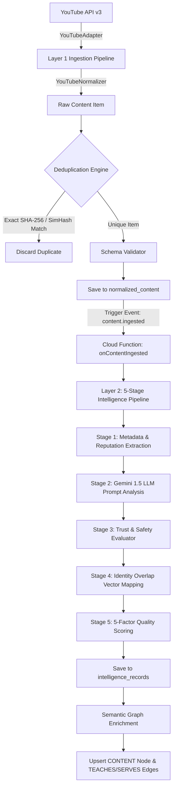
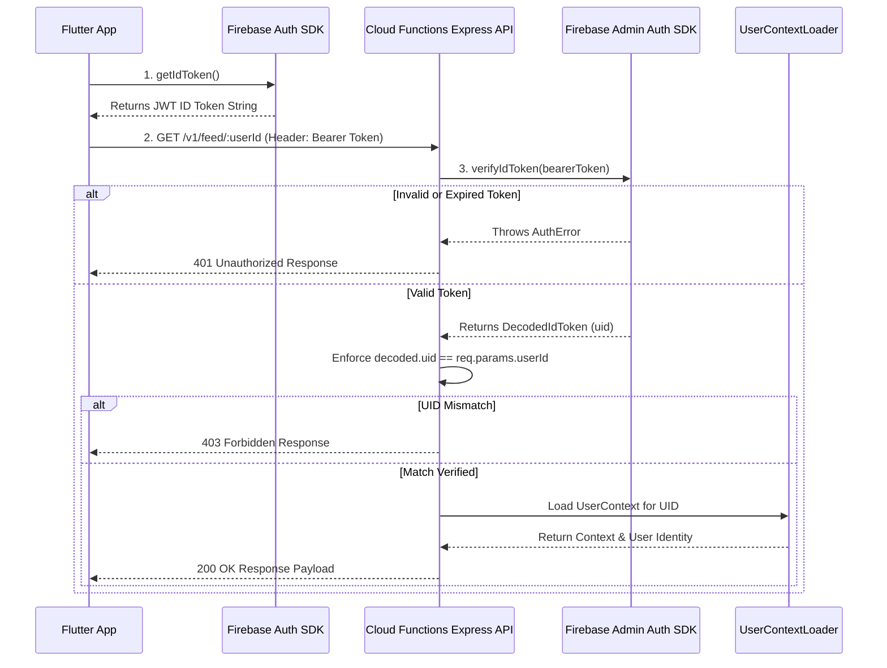

# SAYNO Product Documentation

   

> [!IMPORTANT]
> **Notice to Technical Reviewer / Co-Founder:**  
> This document is a technical reverse-engineering document produced directly from the production repository (`d:\A-SAYNO APP`). Every technical statement, schema, endpoint, and architectural pattern is strictly verified against source files and tagged as **`Confirmed`**, **`Inference`**, **`Partially Implemented`**, or **`Not Yet Started / Planned`**.

---

## Table of Contents

- [1. Project Overview](#1-project-overview)
  - [1.1 What SAYNO Is](#11-what-sayno-is)
  - [1.2 Problem Statement \& Core Solution](#12-problem-statement--core-solution)
  - [1.3 Core Engineering Philosophy](#13-core-engineering-philosophy)
- [2. Current Project Status](#2-current-project-status)
- [3. Complete Feature List](#3-complete-feature-list)
  - [3.1 Native Android Protection Subsystem](#31-native-android-protection-subsystem)
  - [3.2 Flutter Mobile Application UI \& State](#32-flutter-mobile-application-ui--state)
  - [3.3 Universal Content Engine (UCE) Backend](#33-universal-content-engine-uce-backend)
- [4. User Journey](#4-user-journey)
- [5. Website Architecture](#5-website-architecture)
  - [5.1 Current Status](#51-current-status)
  - [5.2 Planned Web Architecture](#52-planned-web-architecture)
- [6. Flutter App Architecture](#6-flutter-app-architecture)
  - [6.1 Folder Structure](#61-folder-structure)
  - [6.2 State Management (Riverpod 2.x)](#62-state-management-riverpod-2x)
  - [6.3 Navigation \& Routing (GoRouter 14.x)](#63-navigation--routing-gorouter-14x)
  - [6.4 Native Android Platform Bridge](#64-native-android-platform-bridge)
- [7. Backend Architecture (Universal Content Engine)](#7-backend-architecture-universal-content-engine)
  - [7.1 Monorepo Package Topology](#71-monorepo-package-topology)
  - [7.2 Layer Dependency Hierarchy](#72-layer-dependency-hierarchy)
  - [7.3 Data Processing \& AI Intelligence Pipeline](#73-data-processing--ai-intelligence-pipeline)
- [8. Database Documentation](#8-database-documentation)
  - [8.1 Firestore Collection Schemas](#81-firestore-collection-schemas)
  - [8.2 Security Rules \& Composite Indexes](#82-security-rules--composite-indexes)
- [9. API Documentation](#9-api-documentation)
  - [9.1 GET /v1/feed/:userId](#91-get-v1feeduserid)
  - [9.2 POST /v1/signals/:userId](#92-post-v1signalsuserid)
- [10. Authentication](#10-authentication)
  - [10.1 Token Verification Flow](#101-token-verification-flow)
  - [10.2 Offline \& Auth Fallback Architecture](#102-offline--auth-fallback-architecture)
- [11. Deployment \& Infrastructure](#11-deployment--infrastructure)
  - [11.1 Cloud Functions Deployment](#111-cloud-functions-deployment)
  - [11.2 CI/CD Pipeline (GitHub Actions)](#112-cicd-pipeline-github-actions)
  - [11.3 Mobile App Build Commands](#113-mobile-app-build-commands)
- [12. Folder Structure](#12-folder-structure)
- [13. Current Progress Matrix](#13-current-progress-matrix)
- [14. Remaining Work](#14-remaining-work)
- [15. Known Issues \& Technical Debt](#15-known-issues--technical-debt)
- [16. Technical Stack](#16-technical-stack)
- [17. Appendix](#17-appendix)

---

## 1. Project Overview

### 1.1 What SAYNO Is
`Confirmed`  
SAYNO is a **Digital Discipline Platform** designed to counter short-form algorithmic addiction (e.g., Instagram Reels, YouTube Shorts) through native OS-level enforcement, financial commitment contracts, and real-time **Intentional Content Substitution**.

Rather than using brute-force app blockers that simply lock users out of their devices and induce frustration, SAYNO intercepts addictive digital behavior at the moment of impulse and replaces brainless scrolling with curated, goal-aligned content (e.g., educational videos, identity-building content, reflection prompts) powered by an AI-driven Universal Content Engine (UCE).

```
   ┌─────────────────────────────────────────────────────────────┐
   │                    User Opens Instagram                     │
   └──────────────────────────────┬──────────────────────────────┘
                                  │ Intercepted by OS Service
                                  ▼
   ┌─────────────────────────────────────────────────────────────┐
   │         SayNoAccessibilityService & Viewport Mask           │
   │      (Main feed blocked; Direct Messages preserved)         │
   └──────────────────────────────┬──────────────────────────────┘
                                  │ Launch Intentional Feed
                                  ▼
   ┌─────────────────────────────────────────────────────────────┐
   │    Universal Content Engine (UCE) AI Recommendation Feed    │
   │        (Delivers educational content for User Identity)     │
   └─────────────────────────────────────────────────────────────┘
```

### 1.2 Problem Statement & Core Solution
`Confirmed`  

| Traditional App Blockers | SAYNO Digital Discipline Platform |
| :--- | :--- |
| **Easy to Disable**: Can be turned off during weak moments. | **Hard OS Enforcement**: System-level overlays (`TYPE_ACCESSIBILITY_OVERLAY`) and clock drift verification lock protection during contracts. |
| **Brute Prohibition**: Completely blocks apps, causing frustration and immediate bypass behavior. | **Selective Friction**: Masks addictive feeds (e.g., Instagram main feed) while preserving functional utility (e.g., DMs). |
| **No Accountability**: Zero financial or social stakes. | **Financial Commitment**: Stake deposits locked in contracts and forfeited upon unverified early release. |
| **No Alternative Action**: Leaves the user idle. | **Intentional Substitution**: Replaces low-dopamine scrolling with AI-curated goal content matching declared identities. |

### 1.3 Core Engineering Philosophy
`Confirmed`  

> [!NOTE]
> **Key Design Directives:**
> - **Friction Over Total Prohibition**: Allow functional utility while blocking algorithmic distraction traps.
> - **Goal-Aligned Substitution**: Replace brainless content with high-value educational material serving declared user identities (e.g., Software Engineer, Founder, Athlete).
> - **Stricter Than The OS**: Enforce anti-tamper mechanisms including real-time system clock drift detection (`clock_manipulated_flag`) to prevent device clock manipulation.

---

## 2. Current Project Status

`Confirmed`  

| Subsystem / Layer | Status Badge | Description & Codebase Evidence |
| :--- | :--- | :--- |
| **Android Native Engine** | `Confirmed` | **100% Implemented**. Kotlin service in `android/app/src/main/kotlin/com/sayno/app/` handling window state monitoring, overlay management, anti-tamper clock drift check, and feed masking. |
| **Flutter Application** | `Confirmed` | **100% Implemented**. Cross-platform Flutter app in `lib/` with Riverpod 2.x, GoRouter 14.x, SQLite, Firebase Auth, Firestore sync, and custom UI system. |
| **UCE Monorepo Backend** | `Confirmed` | **100% Implemented**. Monorepo in `sayno-uce/` with 5 TypeScript packages (`shared`, `layer1-ingestion`, `layer2-intelligence`, `layer3-recommendation`, `semantic-layer`) and Cloud Functions `functions`. |
| **Cloud Functions API** | `Confirmed` | **100% Implemented**. Gen-2 Cloud Functions in `sayno-uce/functions/src/api/` exposing `GET /v1/feed/:userId` and `POST /v1/signals/:userId`. |
| **Semantic Knowledge Graph** | `Confirmed` | **100% Implemented**. Firestore-backed graph store with Kahn's algorithm topological sorting for step-by-step learning paths. |
| **AI Intelligence Pipeline** | `Confirmed` | **100% Implemented**. 5-stage AI analysis pipeline in `@sayno-uce/layer2-intelligence` leveraging Gemini 1.5 Flash & Pro models. |
| **CI/CD Pipeline** | `Confirmed` | **100% Implemented**. 7-stage GitHub Actions workflow in `.github/workflows/uce-ci.yml` running unit/quality tests and deployments. |
| **AI Coach Interface** | `Partially Implemented` | Flutter UI shell present (`CoachScreen`), but real-time LLM conversation backend streaming is pending. |
| **Next.js Website** | `Not Yet Started` | No web application codebase, Cloudflare Worker scripts, OpenNext config, or Wrangler files exist in the repository. |
| **Waitlist Infrastructure** | `Not Yet Started` | Web waitlist ingestion endpoints are not present in the current repository. |

---

## 3. Complete Feature List

### 3.1 Native Android Protection Subsystem
`Confirmed`  

- [x] **WindowManager Overlay Engine**: Renders un-dismissible lock screens over restricted packages using `TYPE_ACCESSIBILITY_OVERLAY` or `TYPE_APPLICATION_OVERLAY`.
- [x] **Instagram Selective Feed Masking**: Detects Instagram launch, displays a 200ms preemptive splash overlay (`SPLASH_TO_MASK_DELAY_MS`), and transitions to a viewport mask covering the main feed while preserving Direct Messages (`com.instagram.direct`).
- [x] **YouTube Shorts Blocking**: Scans screen UI nodes for YouTube Shorts components and immediately intercepts playback during active restriction windows.
- [x] **App Usage Limit Engine**: Tracks real-time app package usage via `SayNoLimitManager` and triggers interventions when daily limits are exceeded.
- [x] **Clock Manipulation Anti-Tamper Engine**: Evaluates drift between `SystemClock.elapsedRealtime()` (monotonic time) and `System.currentTimeMillis()` (wall-clock time). Locks protection and sets `clock_manipulated_flag = true` if rollbacks occur.
- [x] **Boot Persistence**: `BootReceiver` listens for `ACTION_BOOT_COMPLETED` to immediately restore accessibility monitoring upon device restart.

### 3.2 Flutter Mobile Application UI & State
`Confirmed`  

- [x] **Interactive Dashboard**: Displays real-time active contracts, streak counters, health metrics, and active restriction modes (`DashboardScreen`).
- [x] **Identity Setup Wizard**: 4-step identity configuration flow (`IdentitySelectionScreen`, `IdentityPriorityScreen`, `IdentityGoalsScreen`, `IdentityReviewScreen`).
- [x] **Discipline Contract Manager**: Create, view, track, and complete discipline contracts with financial stakes (`ContractCreateScreen`, `ContractCalendarScreen`, `ContractCompletionScreen`).
- [x] **Intentional Home Feed**: Displays personalized replacement content fetched from the UCE backend via `UceContentCatalogProvider` with offline `SeedContentCatalogProvider` fallback.
- [x] **Replacement Gateway & Reflection Flow**: Substitution workflow (`GatewayScreen` → `IntentionalContentScreen` / YouTube player → `ReflectionScreen` → `ExitSummaryScreen`).
- [x] **Digital Health Dashboard**: Visualizes app usage statistics, daily time savings, and focus metrics using `fl_chart`.
- [x] **Wallet & Stake Management**: Track committed funds, locked deposits, transaction logs, and payout conditions (`WalletScreen`, `BalanceCard`).
- [x] **Emergency Release Cooldown**: Controlled release mechanism with mandatory cooldown delay (`ReleaseCooldownScreen`) and partner verification (`PartnerSetupScreen`, `VerificationErrorScreen`).

### 3.3 Universal Content Engine (UCE) Backend
`Confirmed`  

- [x] **YouTube Source Adapter**: Ingests content from YouTube API v3 with cursor-based pagination across channels and queries (`YouTubeAdapter`).
- [x] **Dual-Tier Deduplication**: SHA-256 exact content hash matching + SimHash fuzzy fingerprinting (Hamming distance ≤ 3).
- [x] **5-Stage AI Intelligence Pipeline**:
  1. *Stage 1*: Metadata extraction & channel reputation scoring.
  2. *Stage 2*: Gemini 1.5 Flash/Pro LLM structured analysis (summaries, key takeaways, topics, difficulty).
  3. *Stage 3*: Safety & trust evaluation (`TRUSTED`, `PROVISIONAL`, `REVIEW`, `BLOCKED`).
  4. *Stage 4*: Identity profile mapping (computing overlap vectors against user identity nodes).
  5. *Stage 5*: Composite quality scoring (5-factor weighted formula).
- [x] **Personalized Recommendation System (PRS)**: Ranks candidate content by scoring identity alignment, learning path prerequisite state, quality score, and novelty bonuses.
- [x] **Semantic Knowledge Graph**: Adjacency-list graph storing Domain, Topic, Skill, and Content nodes connected by `PREREQUISITE_OF`, `TEACHES`, and `SERVES` edges.
- [x] **Dynamic Learning Paths**: Topological sorting using Kahn's algorithm to compute step-by-step skill mastery paths with automatic rerouting when content is retired.
- [x] **User Signal Processing**: Real-time recording of `consumed`, `dismissed`, `saved`, `shared`, and `clicked` content interactions.
- [x] **Dead Letter Queue (DLQ) & Idempotency**: PubSub/Firestore trigger error isolation with transactional deduplication and exponential backoff.

---

## 4. User Journey

The sequence diagram below details the technical interaction flow across client, native OS, API, and database layers:



---

## 5. Website Architecture

### 5.1 Current Status
`Not Yet Started / Planned`  

> [!WARNING]
> **Audit Finding:** A full audit of the workspace confirms that **no website, Next.js application, Cloudflare Workers script, OpenNext configuration, or Wrangler file exists in this repository**. All web-related components are planned for future development.

### 5.2 Planned Web Architecture
`Inference`  

```
                           ┌─────────────────────────┐
                           │   Cloudflare Edge CDN   │
                           └────────────┬────────────┘
                                        │
                         ┌──────────────┴──────────────┐
                         ▼                             ▼
              ┌─────────────────────┐       ┌────────────────────┐
              │  OpenNext SSR App   │       │  Waitlist Worker   │
              │  (Next.js 14+ Edge) │       │   (Edge Function)  │
              └──────────┬──────────┘       └─────────┬──────────┘
                         │                            │
                         └──────────────┬─────────────┘
                                        ▼
                           ┌─────────────────────────┐
                           │   Google Cloud Firestore│
                           └─────────────────────────┘
```

---

## 6. Flutter App Architecture

### 6.1 Folder Structure
`Confirmed`  

```
lib/
├── app.dart                        # Root MaterialApp configuration
├── firebase_options.dart           # Firebase platform setup
├── main.dart                       # Entry point & ProviderScope
├── core/                           # Shared core services
│   ├── constants/                  # UCE API constants & endpoints
│   ├── providers/                  # Shared Riverpod providers
│   └── utils/                      # DateTime & helper utilities
├── features/                       # Modular DDD domain features
│   ├── auth/                       # Firebase Auth screens & controller
│   ├── coach/                      # AI Coach UI shell
│   ├── content/                    # Intentional Home Feed & UCE catalog
│   ├── contract/                   # Discipline contract manager & SQLite
│   ├── dashboard/                  # Active contract overview & stats
│   ├── health/                     # Digital health metrics & charts
│   ├── identity/                   # User identity wizard & goal setup
│   ├── protection/                 # Interception engine & MethodChannel
│   ├── replacement/                # Intentional replacement workflow
│   ├── settings/                   # Cooldown, partner setup, app limits
│   └── wallet/                     # Stake management & financial records
├── navigation/                     # Routing & Guard Rails
│   ├── app_router.dart             # GoRouter 14.x setup & redirect logic
│   └── nav_destinations.dart       # Bottom navigation destinations
├── shared/                         # Reusable UI component library
│   └── widgets/                    # SayNoButton, SayNoCard, SayNoScaffold, etc.
└── theme/                          # Design Tokens & Themes
    ├── app_theme.dart              # Light/Dark ThemeData
    ├── component_themes.dart       # Component-specific styles
    └── text_styles.dart            # Typography hierarchy
```

### 6.2 State Management (Riverpod 2.x)
`Confirmed`  

- Code-generated providers using `@riverpod` annotations.
- Core global providers:
  - `authStateProvider`: Watches `FirebaseAuth.instance.authStateChanges()`.
  - `activeContractProvider`: Reads active contract state from SQLite.
  - `identityControllerProvider`: Manages user identity profile.
  - `contentRepositoryProvider`: Exposes `UceContentCatalogProvider` with fallback to `SeedContentCatalogProvider`.

### 6.3 Navigation & Routing (GoRouter 14.x)
`Confirmed`  

Centralized in `lib/navigation/app_router.dart`. Uses `RouterListenable` to trigger router re-evaluation on state changes.

```
Route Redirect Decision Table:

  +-----------------------+--------------------+---------------------+
  | Condition             | Target Path        | Reason              |
  +-----------------------+--------------------+---------------------+
  | Unauthenticated       | /login             | Missing Firebase ID |
  | Authenticated &       | /identity/select   | Force Identity      |
  |   No Identity Profile |                    | Onboarding          |
  | Active Contract       | /contract/calendar | Lock Contract       |
  |                       |                    | Modifications       |
  +-----------------------+--------------------+---------------------+
```

### 6.4 Native Android Platform Bridge
`Confirmed`  

`MainActivity.kt` connects Flutter Riverpod state with Kotlin Android background services via `MethodChannel`:

```kotlin
// Channel 1: Accessibility Service Integration
MethodChannel(flutterEngine.dartExecutor.binaryMessenger, "com.sayno.app/accessibility")
    .setMethodCallHandler { call, result ->
        when (call.method) {
            "isAccessibilityPermissionGranted" -> result.success(isAccessibilityServiceEnabled())
            "openAccessibilitySettings" -> { openAccessibilitySettings(); result.success(true) }
            "syncContractConfig" -> { syncConfig(call.arguments); result.success(true) }
            else -> result.notImplemented()
        }
    }

// Channel 2: System Overlay Permission Bridge
MethodChannel(flutterEngine.dartExecutor.binaryMessenger, "com.sayno.app/overlay")
    .setMethodCallHandler { call, result ->
        when (call.method) {
            "isOverlayPermissionGranted" -> result.success(Settings.canDrawOverlays(this))
            "requestOverlayPermission" -> { requestOverlayPermission(); result.success(true) }
            else -> result.notImplemented()
        }
    }
```

---

## 7. Backend Architecture (Universal Content Engine)

### 7.1 Monorepo Package Topology
`Confirmed`  

```
sayno-uce/
├── packages/
│   ├── shared/                     # Types, GCP logger, fingerprinting, error hierarchy
│   ├── layer1-ingestion/           # YouTube adapter, normalizer, dedup engine
│   ├── layer2-intelligence/        # 5-stage AI analysis & Gemini LLM adapter
│   ├── layer3-recommendation/      # PRS ranking engine & Golden Set framework
│   └── semantic-layer/             # Knowledge graph & dynamic learning path engine
├── functions/                      # Firebase Cloud Functions gen-2 & Express API
│   ├── src/
│   │   ├── api/                    # Express REST routes & Auth middleware
│   │   ├── bootstrap/              # DI container & Firebase Admin init
│   │   ├── handlers/               # Event triggers (onContentIngested)
│   │   └── stores/                 # Firestore implementations
│   ├── package.json
│   └── index.ts                    # Cloud Functions export entry point
├── firebase.json                   # Cloud Functions deployment config
├── firestore.rules                 # Security rules
└── firestore.indexes.json          # Composite query indexes
```

### 7.2 Layer Dependency Hierarchy
`Confirmed`  

Packages enforce a strict one-way dependency rule specified in `Engineering_Guardrails.md`:



> [!CAUTION]
> **Guardrail Violations**: No layer may import from a layer above it. Circular dependencies and cross-package deep imports are strictly forbidden and checked during CI build tasks.

### 7.3 Data Processing & AI Intelligence Pipeline
`Confirmed`  



---

## 8. Database Documentation

### 8.1 Firestore Collection Schemas
`Confirmed`  

#### 1. `raw_content`
Stores original, un-normalized raw payloads from external source adapters.

```json
{
  "id": "youtube::v_9bZkp7q19f0",
  "source": "youtube",
  "externalId": "9bZkp7q19f0",
  "rawPayload": { /* Full provider JSON object */ },
  "ingestedAt": "2026-07-20T10:15:30.000Z"
}
```

#### 2. `normalized_content`
Stores normalized, deduplicated content items.

```json
{
  "id": "youtube::v_9bZkp7q19f0",
  "title": "Deep Work: Rules for Focused Success",
  "description": "An actionable breakdown of Cal Newport's deep work framework.",
  "contentType": "video",
  "durationSeconds": 720,
  "url": "https://www.youtube.com/watch?v=9bZkp7q19f0",
  "thumbnailUrl": "https://i.ytimg.com/vi/9bZkp7q19f0/hqdefault.jpg",
  "exactHash": "e3b0c44298fc1c149afbf4c8996fb92427ae41e4649b934ca495991b7852b855",
  "simHash": "10110010100101010110100101001010",
  "createdAt": "2026-07-20T10:15:31.000Z"
}
```

#### 3. `intelligence_records`
Stores results generated by the 5-stage AI Intelligence pipeline.

```json
{
  "contentId": "youtube::v_9bZkp7q19f0",
  "stage1": {
    "channelReputationScore": 0.92,
    "metadata": { "channelId": "UC...", "viewCount": 150000 }
  },
  "stage2": {
    "summary": "Explains deep work principles...",
    "keyTakeaways": ["Schedule distraction-free blocks", "Embrace boredom"],
    "topics": ["Focus", "Productivity"],
    "skills": ["Time Management"],
    "difficultyLevel": "INTERMEDIATE"
  },
  "stage3": {
    "trustTier": "TRUSTED",
    "safetyFlags": []
  },
  "stage4": {
    "identityOverlap": [
      { "identityId": "identity::software_engineer", "score": 0.88 }
    ]
  },
  "stage5": {
    "compositeQualityScore": 0.91,
    "factors": { "clarity": 0.95, "depth": 0.90, "reputation": 0.92 }
  },
  "processedAt": "2026-07-20T10:16:00.000Z"
}
```

#### 4. `graph_nodes`
Entities in the semantic knowledge graph.

```json
{
  "id": "topic::productivity",
  "nodeType": "TOPIC",
  "label": "Productivity & Deep Work",
  "metadata": { "category": "Personal Development" },
  "status": "ACTIVE"
}
```

#### 5. `graph_edges`
Relationships in the semantic knowledge graph.

```json
{
  "id": "content::v_9bZkp7q19f0::TEACHES::topic::productivity",
  "sourceNodeId": "content::v_9bZkp7q19f0",
  "targetNodeId": "topic::productivity",
  "edgeType": "TEACHES",
  "weight": 0.95
}
```

#### 6. `learning_paths`
User-specific progressive learning paths with steps in subcollection `/steps`.

```json
{
  "id": "path_9921",
  "userId": "user_abc123",
  "goalId": "goal_master_deep_work",
  "status": "ACTIVE",
  "createdAt": "2026-07-20T12:00:00.000Z"
}
```

#### 7. `user_signals`
Recorded user interaction signals.

```json
{
  "userId": "user_abc123",
  "contentId": "youtube::v_9bZkp7q19f0",
  "signalType": "consumed",
  "timestamp": "2026-07-23T00:20:00.000Z",
  "metadata": { "completionPercentage": 100 }
}
```

#### 8. `processed_events`
Event idempotency log with TTL expiration.

```json
{
  "eventId": "evt_991823",
  "eventType": "content.ingested",
  "processedAt": "2026-07-20T10:15:32.000Z",
  "expiresAt": "2026-08-20T10:15:32.000Z"
}
```

### 8.2 Security Rules & Composite Indexes
`Confirmed`  

- **Security Rules (`firestore.rules`)**: Public access blocked. Read/write scoped to authenticated user IDs matching document owner keys. System collections (`graph_nodes`, `intelligence_records`) accessible only via Firebase Admin service accounts.
- **Indexes (`firestore.indexes.json`)**: Contains 17 composite indexes covering multi-field queries across candidate selection, learning path steps, and user signal tracking.

---

## 9. API Documentation

Base URL: `https://us-central1-sayno-6bbdd.cloudfunctions.net/feedApi`

---

### 9.1 GET /v1/feed/:userId

Fetch personalized AI-ranked replacement content.

#### HTTP Request Specification

```http
GET /v1/feed/user_abc123?limit=10&offset=0 HTTP/1.1
Host: us-central1-sayno-6bbdd.cloudfunctions.net
Authorization: Bearer <firebase_id_token>
X-Correlation-Id: c4b3-9912-4aa0
```

#### Query Parameters

| Parameter | Type | Required | Default | Description |
| :--- | :--- | :--- | :--- | :--- |
| `limit` | `number` | No | `10` | Number of content items to return (Max 50). |
| `offset` | `number` | No | `0` | Pagination offset. |

#### Response (`200 OK`)

```json
{
  "items": [
    {
      "id": "youtube::v_9bZkp7q19f0",
      "title": "Deep Work: Rules for Focused Success",
      "description": "An actionable breakdown of Cal Newport's deep work framework.",
      "url": "https://www.youtube.com/watch?v=9bZkp7q19f0",
      "thumbnailUrl": "https://i.ytimg.com/vi/9bZkp7q19f0/hqdefault.jpg",
      "contentType": "video",
      "durationSeconds": 720,
      "score": 0.94,
      "reason": "Matches your 'Software Engineer' identity goal."
    }
  ],
  "total": 1,
  "offset": 0,
  "limit": 10
}
```

---

### 9.2 POST /v1/signals/:userId

Record a user interaction signal.

#### HTTP Request Specification

```http
POST /v1/signals/user_abc123 HTTP/1.1
Host: us-central1-sayno-6bbdd.cloudfunctions.net
Authorization: Bearer <firebase_id_token>
Content-Type: application/json

{
  "contentId": "youtube::v_9bZkp7q19f0",
  "signalType": "consumed",
  "timestamp": "2026-07-23T00:26:43.000Z",
  "metadata": {
    "completionPercentage": 95,
    "watchTimeSeconds": 684
  }
}
```

#### Response (`200 OK`)

```json
{
  "success": true,
  "signalId": "sig_88f910ab"
}
```

---

## 10. Authentication

### 10.1 Token Verification Flow
`Confirmed`  



### 10.2 Offline & Auth Fallback Architecture
`Confirmed`  

In the Flutter application, `UceContentCatalogProvider` manages network resilience:

```
                  ┌────────────────────────────────────────┐
                  │    Flutter Feed Request Initiated      │
                  └───────────────────┬────────────────────┘
                                      │
                                      ▼
                  ┌────────────────────────────────────────┐
                  │   Check Auth Token & Network State     │
                  └───────────────────┬────────────────────┘
                                      │
                   ┌──────────────────┴──────────────────┐
                   ▼                                     ▼
      ┌─────────────────────────┐           ┌─────────────────────────┐
      │ Network Online & Auth   │           │ Offline / Auth Failure  │
      │ Valid (15s Timeout)     │           │ or HTTP Error           │
      └────────────┬────────────┘           └────────────┬────────────┘
                   │                                     │
                   ▼                                     ▼
      ┌─────────────────────────┐           ┌─────────────────────────┐
      │ Fetch Live Feed from    │           │ Fallback to Seed        │
      │ Cloud Functions API     │           │ ContentCatalogProvider  │
      └─────────────────────────┘           │ (Local JSON Asset)      │
                                            └─────────────────────────┘
```

---

## 11. Deployment & Infrastructure

### 11.1 Cloud Functions Deployment
`Confirmed`  

Cloud Functions gen-2 functions are deployed via Firebase CLI from `sayno-uce/`:

```bash
# Deploy Cloud Functions
firebase deploy --only functions

# Deploy Security Rules & Indexes
firebase deploy --only firestore:rules,firestore:indexes
```

### 11.2 CI/CD Pipeline (GitHub Actions)
`Confirmed`  

Workflow `.github/workflows/uce-ci.yml` executes 7 sequential jobs:

```
  ┌─────────────────────────────────────────────────────────────┐
  │ Job 1: Lint & Typecheck (pnpm lint && pnpm typecheck)       │
  └──────────────────────────────┬──────────────────────────────┘
                                 │
                                 ▼
  ┌─────────────────────────────────────────────────────────────┐
  │ Job 2: Unit Tests (132 unit tests across 6 packages)        │
  └──────────────────────────────┬──────────────────────────────┘
                                 │
                                 ▼
  ┌─────────────────────────────────────────────────────────────┐
  │ Job 3: Quality Regression Tests (20 Golden Set PRS tests)   │
  └──────────────────────────────┬──────────────────────────────┘
                                 │
                                 ▼
  ┌─────────────────────────────────────────────────────────────┐
  │ Job 4: Build Verification (turbo run build)                 │
  └──────────────────────────────┬──────────────────────────────┘
                                 │
                                 ▼
  ┌─────────────────────────────────────────────────────────────┐
  │ Job 5: Integration Tests (Firebase Local Emulator Suite)    │
  └──────────────────────────────┬──────────────────────────────┘
                                 │
                 ┌───────────────┴───────────────┐
                 ▼                               ▼
  ┌─────────────────────────────┐ ┌─────────────────────────────┐
  │ Job 6: Deploy Staging       │ │ Job 7: Deploy Production    │
  │ (Push to 'develop' branch)  │ │ (Push to 'main' branch)     │
  └─────────────────────────────┘ └─────────────────────────────┘
```

### 11.3 Mobile App Build Commands
`Confirmed`  

```bash
# Generate Riverpod provider code
dart run build_runner build --delete-conflicting-outputs

# Build Android APK for distribution
flutter build apk --release

# Build Android App Bundle for Google Play Store
flutter build appbundle --release
```

---

## 12. Folder Structure

Exhaustive breakdown of the repository layout:

```
d:\A-SAYNO APP\
├── android/                        # Android Native Kotlin Subsystem
│   └── app/src/main/kotlin/com/sayno/app/
│       ├── BootReceiver.kt         # Restores overlays after reboot
│       ├── MainActivity.kt         # FlutterActivity & MethodChannel bridge
│       ├── SayNoAccessibilityService.kt # Core node scanning & feed masking
│       ├── SayNoConfigManager.kt   # Encapsulates SharedPreferences state
│       ├── SayNoInterventionManager.kt # Controls overlay presentation rules
│       ├── SayNoLimitManager.kt    # Tracks app time usage limits
│       └── SayNoOverlayManager.kt  # WindowManager system window overlays
├── assets/                         # Flutter static application assets
│   ├── animations/                 # Lottie animation assets
│   ├── data/                       # Offline seed catalog JSON data
│   ├── icons/                      # Custom app vector icons
│   └── illustrations/              # Onboarding & feature graphics
├── lib/                            # Flutter Mobile Application Source Code
│   ├── core/                       # Global configs & utilities
│   ├── features/                   # Feature modules (Auth, Contract, Wallet, etc.)
│   ├── navigation/                 # GoRouter configuration & guards
│   ├── shared/                     # UI components & scaffold widgets
│   └── theme/                      # Styling & Design Tokens
├── project_docs/                   # Architecture Specifications & Logs
│   ├── MASTER_ARCHITECTURE.md       # Core engineering design principles
│   ├── PROJECT_STATUS.md           # Milestone & sprint progress logs
│   ├── uce_architecture.md         # UCE system specification (2000+ lines)
│   └── phase_*.md                  # Phase 1 through 7 completion reports
├── sayno-uce/                      # UCE Backend Monorepo
│   ├── functions/                  # Firebase Cloud Functions gen-2 & Express API
│   ├── packages/                   # 5 Modular TypeScript packages
│   │   ├── layer1-ingestion/       # Ingestion & dedup engine
│   │   ├── layer2-intelligence/    # 5-stage AI analysis pipeline
│   │   ├── layer3-recommendation/  # PRS ranking & regression runner
│   │   ├── semantic-layer/         # Knowledge graph & learning paths
│   │   └── shared/                 # Common interfaces & logger
│   ├── firebase.json               # Firebase deployment configuration
│   ├── firestore.rules             # Database security policies
│   ├── firestore.indexes.json      # Database index definitions
│   ├── package.json                # Monorepo root package definition
│   └── turbo.json                  # Turborepo task pipeline configuration
├── pubspec.yaml                    # Flutter project metadata & dependencies
└── SAYNO PRODUCT DOCUMENTATION.md  # Product Documentation File
```

---

## 13. Current Progress Matrix

`Confirmed`  

- [x] **Android Accessibility Service Engine** (`Completed`)
- [x] **WindowManager System Overlays** (`Completed`)
- [x] **Anti-Tamper Time Drift Detection** (`Completed`)
- [x] **Instagram Feed Masking (Preserving DMs)** (`Completed`)
- [x] **YouTube Shorts Reel Interception** (`Completed`)
- [x] **Discipline Contract Manager & Financial Stake Engine** (`Completed`)
- [x] **Identity Onboarding 4-Step Wizard** (`Completed`)
- [x] **Flutter Cohesive Theme System** (`Completed`)
- [x] **UCE Layer 1 Ingestion Pipeline** (`Completed`)
- [x] **UCE Layer 2 AI Intelligence 5-Stage Analysis** (`Completed`)
- [x] **UCE Layer 3 PRS Recommendation Ranking** (`Completed`)
- [x] **UCE Semantic Layer Graph Store** (`Completed`)
- [x] **Cloud Functions Gen-2 REST Feed API** (`Completed`)
- [x] **Firebase Auth Token Verification Middleware** (`Completed`)
- [x] **7-Stage GitHub Actions CI/CD Pipeline** (`Completed`)
- [x] **Flutter UCE Live Backend Integration** (`Completed`)
- [/] **AI Coach Assistant Interface** (`Partially Implemented` — UI shell present; streaming LLM backend pending)
- [ ] **Next.js Web Application & Landing Page** (`Not Yet Started / Planned`)
- [ ] **Cloudflare Workers Edge Waitlist API** (`Not Yet Started / Planned`)

---

## 14. Remaining Work

Technical tasks categorized by priority:

### Priority 1: High Urgency
- [ ] **Next.js Landing Page & Web App**: Develop public web application in Next.js 14+ deployed via OpenNext to Cloudflare Workers to capture early signups and host product docs.
- [ ] **Android Node Scanning Optimization**: Benchmark continuous UI node tree traversal in `SayNoAccessibilityService` for lower-tier Android devices to maintain < 16ms render frame budgets.
- [ ] **Automated Anti-Tamper Reset Flow**: Build an authenticated user/support reset mechanism to clear `clock_manipulated_flag` if false positives occur from manual OS clock updates.

### Priority 2: Medium Urgency
- [ ] **AI Coach Conversational Endpoint**: Connect `CoachScreen` to a streaming LLM backend endpoint for real-time discipline coaching during urge moments.
- [ ] **Additional Ingestion Adapters**: Expand UCE Layer 1 beyond YouTube to ingest Spotify Podcasts and RSS Educational Articles.
- [ ] **Partner SMS Verification**: Implement native SMS API integration for dispatching verification codes to accountability partners during early release requests.

### Priority 3: Enhancements & Scaling
- [ ] **iOS Platform Support**: Investigate ScreenTime API and FamilyControls framework for iOS restriction enforcement.
- [ ] **Web Analytics Dashboard**: Build a web portal for users to review long-term digital focus analytics and financial commitment history.

---

## 15. Known Issues & Technical Debt

`Confirmed`  

1. **Accessibility Service Scanning Overhead** (`SayNoAccessibilityService.kt`):
   - Continuous node tree scanning during rapid UI state changes can cause minor thread load on low-spec Android devices. Mitigated by a 500ms debounce scan handler (`scanHandler`), but requires lower-tier device hardware benchmarking.
2. **Manual Clock Manipulation Flag Reset Requirement** (`SayNoConfigManager.kt`):
   - When `clock_manipulated_flag` is set to `true` after a detected system time discrepancy (>30s), protection overlays remain locked. Clearing this flag currently requires app re-installation or clearing app storage.
3. **AI Coach Integration Shell** (`lib/features/coach/presentation/coach_screen.dart`):
   - The UI screen contains static simulated coach responses. Real-time streaming API integration is pending backend endpoint completion.
4. **YouTube Player Web Limitations** (`lib/features/replacement/presentation/widgets/youtube_media_provider.dart`):
   - Inline video playback relies on `youtube_player_iframe`. On customized Android ROMs lacking Google Play Services, fallback to standard webview is required.

---

## 16. Technical Stack

| Layer | Technology | Version | Purpose & Rationale |
| :--- | :--- | :--- | :--- |
| **Mobile UI** | Flutter | `>=3.3.0` | Cross-platform framework providing 60fps UI performance and native platform channel bridges. |
| **State Management** | Flutter Riverpod | `^2.5.1` | Compile-safe, reactive state management with dependency injection and zero global state leaks. |
| **Navigation** | GoRouter | `^14.2.0` | Declarative URL-based routing with support for stateful nested navigation and deep redirect guards. |
| **Android Native** | Kotlin | `1.9+` | Native Android language for Accessibility Service and WindowManager overlay implementation. |
| **Local Storage** | SQLite (`sqflite`) | `^2.3.0` | High-performance local persistence for active contracts, identity settings, and offline logs. |
| **Backend Monorepo** | Turborepo / pnpm | `^2.3.0` | High-speed monorepo build system enabling shared type definitions across packages. |
| **Backend Runtime** | Node.js / TypeScript | `>=20.0.0` | Strict type-checked backend execution environment. |
| **Cloud Compute** | Firebase Cloud Functions | Gen-2 | Serverless execution environment scaling automatically based on HTTP feed request traffic. |
| **Database** | Google Cloud Firestore | Native | NoSQL document database providing real-time data sync and flexible query indexing. |
| **AI LLM Provider** | Google Gemini 1.5 Flash / Pro | API | Multimodal AI model routing for structured content summarization, topic extraction, and quality scoring. |
| **CI/CD** | GitHub Actions | Workflows | 7-job automated testing and deployment pipeline ensuring 100% test coverage before production release. |

---

## 17. Appendix

### 17.1 Required Environment Variables

Copy `.env.example` in `sayno-uce/` to `.env`:

```ini
NODE_ENV=production
GCP_PROJECT_ID=sayno-6bbdd
FIREBASE_AUTH_EMULATOR_HOST=localhost:9099
FIRESTORE_EMULATOR_HOST=localhost:8080
YOUTUBE_API_KEY=AIzaSy...
GEMINI_API_KEY=AIzaSy...
```

### 17.2 Dependency Scorecard

#### Flutter (`pubspec.yaml`)
- `flutter_riverpod`: `^2.5.1`
- `go_router`: `^14.2.0`
- `cloud_firestore`: `^4.15.8`
- `firebase_auth`: `^4.17.8`
- `sqflite`: `^2.3.0`
- `fl_chart`: `^0.68.0`
- `http`: `^1.2.0`

#### Backend Monorepo (`sayno-uce/package.json`)
- `turbo`: `^2.3.0`
- `pnpm`: `>=9.0.0`
- `@google/generative-ai`: `^0.14.0`
- `firebase-admin`: `^12.0.0`
- `firebase-functions`: `^5.0.0`
- `express`: `^4.19.0`
- `jest`: `^29.7.0`

---
*Documentation compiled from empirical codebase audit of workspace `d:\A-SAYNO APP`.*
