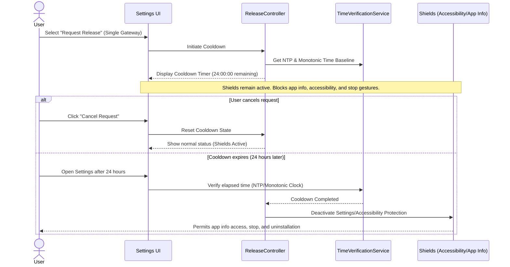
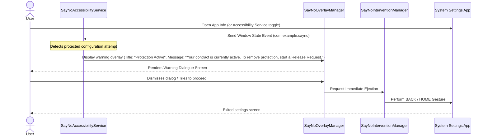
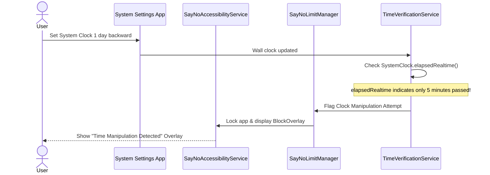

# Phase 4 Blueprint: The Vault Layer

## 1. Objective
The primary objective of **Phase 4: The Vault Layer** is to protect the integrity and enforce the binding nature of the Contract System created in Phase 3. It achieves this by securing the application against attempts to disable, uninstall, or manipulate its rules. 

By introducing time verification, reboot survival, accessibility settings warning overlays, and settings intercept shields, the Vault Layer ensures that the commitments established by the user are strictly observed and cannot be bypassed in a moment of impulse.

---

## 2. Philosophy
Most digital blocking or habit-forming applications fail because they are too easy to disable or uninstall in a moment of weakness. However:
* **The goal is NOT to make uninstall completely impossible.** Android OS constraints ultimately make a 100% lock-in impossible without root permissions or Device Administrator MDM enrollment, and attempting to do so can alienate users.
* **Impulse Delay > Technical Impossibility.** The goal is to make bypassing difficult enough that the impulse passes. By inserting an unbreakable 24-hour cooling-off period before protection can be deactivated or uninstalled, the app serves as a primary friction mechanism. This provides enough time for high-dopamine impulses to subside, allowing the user to re-engage their rational self and make reasoned choices.
* **Uninstall Delayed, Not Prevented.** Since permanent uninstall prevention cannot be guaranteed on unrooted Android devices, the platform's posture changes from "impossible to uninstall" to "delayed uninstall."

---

## 3. Modules

### Module A: Time Drift Shield
* **Purpose**: Prevent manipulation of system time (clock rollback or forwarding) to cheat contracts, reset daily limits early, or fake streak progress.
* **Core Mechanisms**:
  1. **NTP Time Verification**: Periodically query a trusted Network Time Protocol (NTP) server to obtain network-validated coordinates rather than trusting the local device's wall-clock time.
  2. **Monotonic Hardware Clock**: Leverage Android's `SystemClock.elapsedRealtime()` which counts elapsed milliseconds since the device booted (including sleep state). Because it is a hardware monotonic clock, it cannot be modified by the user or NTP adjustments.
  3. **Drift Detection**: When NTP is temporarily unavailable, compare the delta in the device's wall clock with the delta in `SystemClock.elapsedRealtime()`. If the wall clock moves forward or backward by an amount inconsistent with the monotonic clock (with a tolerance threshold), trigger a lock state.
  4. **State Integrity**: Guard:
     - [Contract](file:///d:/sayno-main-phase-1/lib/features/contract/domain/contract.dart) progression and expiration.
     - Streaks and credits.
     - Daily usage limits inside [SayNoLimitManager](file:///d:/sayno-main-phase-1/android/app/src/main/kotlin/com/example/sayno/SayNoLimitManager.kt).

### Module B: Boot Recovery
* **Purpose**: Ensure that the application's protection state automatically recovers and resumes surveillance as soon as the device is restarted.
* **Core Mechanisms**:
  1. **Boot Receiver**: A native Kotlin `BroadcastReceiver` listening to `android.intent.action.BOOT_COMPLETED` (and `LOCKED_BOOT_COMPLETED` for Direct Boot mode compatibility).
  2. **Automated Restoration**: On boot, the system invokes [SayNoConfigManager](file:///d:/sayno-main-phase-1/android/app/src/main/kotlin/com/example/sayno/SayNoConfigManager.kt) to retrieve configuration profiles from `SharedPreferences` and ensure the [SayNoAccessibilityService](file:///d:/sayno-main-phase-1/android/app/src/main/kotlin/com/example/sayno/SayNoAccessibilityService.kt) is running and configured.
  3. **Persistent Enforcement**: Active tracking, daily limits, and keyword scanning recover immediately, blocking any bypass attempts that utilize device restarts.

### Module C: Accessibility Shield
* **Purpose**: Prevent the user from disabling the `SayNoAccessibilityService` in System Settings during an active commitment.
* **Core Mechanisms**:
  1. **Window Interception**: The accessibility service listens for package and window state events from the Android System Settings app (`com.android.settings`).
  2. **Activity Name Detection**: Detect when the settings sub-screen for "Accessibility Services", "Downloaded Services", or specifically the "SayNO Accessibility Service Toggle" is active.
  3. **Intervention & Warning Screen**: Instead of silently backing out, display a dedicated native warning/intervention overlay directly over the settings panel before executing the back gesture:
     * **Title**: `Protection Active`
     * **Message**: `Your contract is currently active. To remove protection, start a Release Request.`
  4. **Intervention Action**: Perform a programmatic back-out (using `GLOBAL_ACTION_BACK` or `GLOBAL_ACTION_HOME` actions via [SayNoInterventionManager](file:///d:/sayno-main-phase-1/android/app/src/main/kotlin/com/example/sayno/SayNoInterventionManager.kt)) when the user attempts to dismiss the overlay or bypass it.
  5. **Conditional Status**: This shield is **strictly active only while a contract is active**. When no contracts are running, the user is free to modify accessibility permissions normally.

### Module D: App Info Shield
* **Purpose**: Block attempts to disable the app via settings bypasses (e.g., Uninstalling, Force Stopping, or Clearing storage).
* **Core Mechanisms**:
  1. **App Settings Detection**: Intercept navigation to the "App Info" page of SayNO (`com.example.sayno`) within the Settings application or Package Installer package.
  2. **Element/Layout Scanning**: Scan layout node texts for action targets such as "Uninstall", "Force Stop", or "Clear Data / Storage".
  3. **Warning & Auto-Dismissal**: Display the warning overlay (`Protection Active...`) explaining that these actions are protected, then trigger `GLOBAL_ACTION_BACK` or `GLOBAL_ACTION_HOME` actions to close the app settings view.

### Module E: Release Request System
* **Purpose**: Provide a structured, friction-based deactivation gateway for users who wish to remove protection, while preventing impulsive actions.
* **Single Gateway Concept**:
  - The Release Request System is the **exclusive gateway** for removing protection. A Release Request must be active and the 24-hour cooldown must expire before the user is allowed to:
    1. Disable the Accessibility Service
    2. Force Stop SayNO
    3. Uninstall SayNO
    4. End Active Protection
* **Core Mechanisms**:
  1. **Request Phase**: The user initiates a "Request Release" action from the settings.
  2. **24-Hour Cooldown**: Starts a 24-hour countdown timer. During this period:
     - The application continues enforcing all limits, contracts, and keyword blocks.
     - The remaining time is persistently tracked and verified using NTP and monotonic clocks.
  3. **Cancellation Option**: The user can cancel the release request at any point during the 24 hours, immediately reverting the app to normal secured mode.
  4. **Removal Authorization**: Once the 24 hours have completely passed, the app unlocks, disabling the Accessibility & App Info Shields and allowing deactivation/uninstallation.

### Module F: Release Analytics
* **Purpose**: Track user behavioral patterns around uninstall impulses to help calibrate the friction mechanisms.
* **Captured Events**:
  1. **Release Requested**: Log when a user initiates a removal cooldown, capturing active contract states and duration.
  2. **Release Cancelled**: Log when a request is aborted, tracking how far into the 24-hour period the user had progressed.
  3. **Release Completed**: Log when a cooldown completes and the deactivation/uninstall is executed.
* **Persistence**: Analytics are stored locally and synced when online.

---

## 4. User Flows

### Flow 1: Release Request & Cooldown


### Flow 2: Attempting Settings Bypass (Warning Screen Interface)


### Flow 3: Clock Manipulation Attempt


---

## 5. Technical Notes

### Kotlin (Native Android Engine)
* **Accessibility Interception**:
  - The [SayNoAccessibilityService](file:///d:/sayno-main-phase-1/android/app/src/main/kotlin/com/example/sayno/SayNoAccessibilityService.kt) needs to inspect window transitions. Settings screens frequently use the package `com.android.settings` and activity classes like `com.android.settings.Settings$AccessibilitySettingsActivity` or layouts containing button views with IDs `com.android.settings:id/force_stop_button` and `com.android.settings:id/uninstall_button`.
  - Draw the "Protection Active" overlay screen using [SayNoOverlayManager](file:///d:/sayno-main-phase-1/android/app/src/main/kotlin/com/example/sayno/SayNoOverlayManager.kt) to inform the user about the active contract state, then execute `performGlobalAction(GLOBAL_ACTION_BACK)` or `GLOBAL_ACTION_HOME` via [SayNoInterventionManager](file:///d:/sayno-main-phase-1/android/app/src/main/kotlin/com/example/sayno/SayNoInterventionManager.kt).
* **Boot Integration**:
  - Create a new `BroadcastReceiver` registered in `AndroidManifest.xml` under:
    ```xml
    <receiver android:name=".BootReceiver" android:enabled="true" android:exported="true">
        <intent-filter>
            <action android:name="android.intent.action.BOOT_COMPLETED" />
            <action android:name="android.intent.action.QUICKBOOT_POWERON" />
        </intent-filter>
    </receiver>
    ```
* **Hardware Clock Validation**:
  - Update [SayNoLimitManager](file:///d:/sayno-main-phase-1/android/app/src/main/kotlin/com/example/sayno/SayNoLimitManager.kt) to store both `System.currentTimeMillis()` and `SystemClock.elapsedRealtime()` in `sayno_usage` preferences during each check.
  - Verification check: `delta_wall_clock` must be proportional to `delta_monotonic_clock` within a tolerance range (e.g., ±30 seconds). If `delta_wall_clock < 0` or is significantly larger than `delta_monotonic_clock`, assume clock manipulation.

### Dart (Flutter Application Layer)
* **TimeVerificationService**:
  - Integrate a Flutter client query for NTP servers (e.g., using `ntp` package or simple HTTP requests to a trusted server with cache headers).
  - Sync verified timestamp down to native Kotlin code via [ProtectionPlatformService](file:///d:/sayno-main-phase-1/lib/features/protection/data/protection_platform_service.dart) (`updateVerifiedTime`).
* **ReleaseRequest Model & Persistence**:
  - Introduce `ReleaseRequest` domain model containing `requestedAt`, `cooldownDuration`, and `isCompleted`.
  - Store request status in SQLite and read on startup.
* **Active Contract Integration**:
  - [ContractController](file:///d:/sayno-main-phase-1/lib/features/contract/application/contract_controller.dart) must communicate with the native side (`MethodChannel.invokeMethod('updateActiveContractStatus', isActive)`) so accessibility blocking triggers only when a contract is active.

---

## 6. Phase 5 Compatibility
The Release Request System is designed as the baseline deactivation state machine to ensure future expandability. By structuring deactivation as an asynchronous lifecycle state (Proposed → Cooldown → Approved), Phase 4 establishes a foundation that directly integrates with future Phase 5 (Fortress Mode) features without requiring a structural redesign:
1. **Partner Approval Integration**: The transition from the "Cooldown Completed" state to "Removal Authorized" can be configured to block until a signal is received from an Accountability Partner's remote device.
2. **OTP Release Workflows**: Instead of automatically unlocking the app upon cooldown completion, the system can require an OTP code sent to an external contact or partner.
3. **Accountability Alerts**: The initiation and progress of the Release Request can hook directly into notification webhooks, notifying accountability partners immediately when a request is requested, cancelled, or completed.

---

## 7. Success Criteria
Phase 4 is complete when the following verification conditions are satisfied:

* [x] **Time Cheating Blocked**: Clock rollback or forwarding fails to bypass contract limitations, daily limit reset tracking, or streak rules.
* [x] **Reboot Survival**: Device power cycling (reboots) automatically restores config definitions and re-enables active accessibility restrictions.
* [x] **Accessibility Protection**: Attempts to toggle off the "SayNO Accessibility Service" during an active contract are intercepted, displaying the warning/intervention overlay and returning the user back or home.
* [x] **Force Stop Intercepted**: Accessing the App Info screen to click "Force Stop" on SayNO is intercepted, showing the warning/intervention screen and exiting settings.
* [x] **Uninstall Delayed**: Uninstall attempts are delayed through the Release Request System. Uninstalling is blocked until the 24-hour cooldown expires.
* [x] **Single Gateway Enforcement**: Access to disabling Accessibility Service, Force Stopping the app, Uninstalling the app, or Ending Active Protection are all blocked unless a Release Request has been initiated and its 24-hour cooldown has expired.
* [x] **Release Request Cooldown**: The 24-hour countdown correctly enforces the delay, keeping protection fully active until the timer is complete.
* [x] **Release Cancellation**: The user can cancel a pending release request, resetting the app back to normal fully-protected status.
* [x] **Contract Integrity**: All active contracts created under Phase 3 are preserved and cannot be subverted by disabling protection prematurely.
