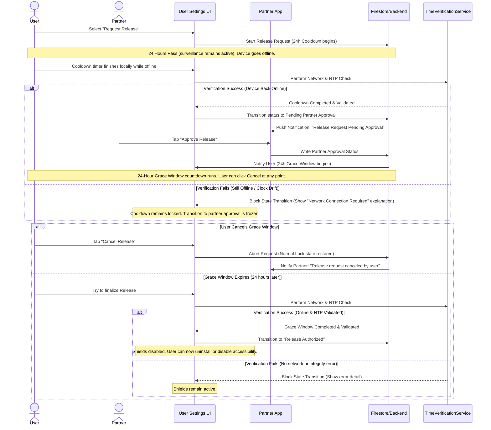
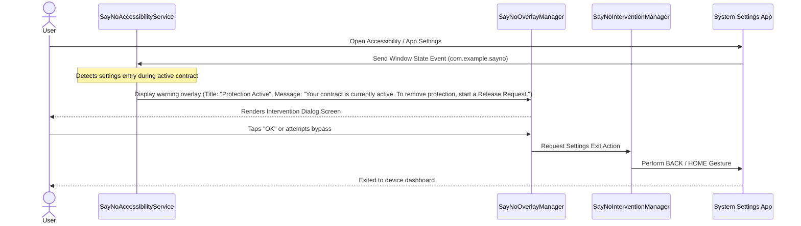

# Phase 5 Blueprint: Human Accountability (Fortress Mode)

## 1. Objective
The objective of **Phase 5: Human Accountability** is to establish the social friction layer of SayNO. By transitioning deactivation logic from automated device-level blocks (Phase 4: The Vault Layer) to interpersonal commitments, Phase 5 locks down the app against self-sabotage using human accountability. 

This phase integrates Firebase cloud synchronization to protect local databases from tampering (such as storage clearing or reinstallation) and secures deactivation permissions behind a multi-step partner verification process.

---

## 2. Philosophy
* **Social Friction > Technical Lockouts**: Code can always be bypassed with enough technical determination (factory resets, OS-level hacks). However, human accountability introduces emotional investment, transparency, and personal commitment. Users are far less likely to bypass a restriction when doing so requires an active explanation to someone they respect.
* **Delay & Reflection (The Double Cooldown)**: Impulsive urges are temporary, high-arousal mental states. By stretching the deactivation process over multiple stages (Release Request → 24-Hour Cooldown → Partner Approval → 24-Hour Final Grace Window), we ensure that the user has ample time to calm down, reflect, and cancel the request.
* **Partner Security**: The partner is an active guard. They must be empowered to deny bypass requests and must be protected from physical coercion (enabled by the 24-hour Grace Window).

---

## 3. Modules

### Module A: Partner Management System
* **Purpose**: Authenticate, link, and sync the user with a single, trusted accountability partner.
* **Core Mechanisms**:
  1. **Authentication**: Users and partners authenticate via Firebase Authentication.
  2. **Link Generation**: The user invites a partner by email. The backend writes a pending link inside the `/partnerships` collection in Firestore.
  3. **Verification Loop**: The partner receives a push notification, enters the verification code, and accepts the link. Once accepted, both profiles enter the "Linked" state.
  4. **State Protection**: Links cannot be removed by the user while a contract is active unless authorized by the Release Request System.

### Module B: Cloud-Synchronized State Engine
* **Purpose**: Sync active contracts and configuration data to Firestore to prevent bypass attempts using data deletion (such as clearing application storage or reinstalling the app).
* **Core Mechanisms**:
  1. **Dynamic Config Sync**: Whenever a contract is created, updated, or expires, [ContractController](file:///d:/sayno-main-phase-1/lib/features/contract/application/contract_controller.dart) writes the state to Firestore.
  2. **Pessimistic Re-activation**: Upon login (such as after storage deletion or reinstallation), the app checks Firestore for any active contracts. If found, the local system immediately locks down, re-enables shields, and blocks access until the contracts expire or are legally released.
  3. **Offline Integrity**: If the app is offline during launch, it defaults to the last-known cached locked state.

### Module C: Human-Gated Release Request System
* **Purpose**: Enforce the multi-layered deactivation gate for removing protection, turning it into the single gateway for deactivating accessibility shields, uninstalling, or stopping the app.
* **Conditional Flow Branching (Partnerless Fallback)**:
  - **No Partner Linked**: The release request pipeline automatically falls back to the local **Phase 4** workflow:
    `Release Request (Settings) -> 24-Hour Cooldown -> Release Authorized (Shields disabled)`
  - **Partner Linked**: The app enforces the full **Phase 5** partner workflow:
    `Release Request (Settings) -> 24-Hour Cooldown -> Partner Approval -> 24-Hour Grace Window -> Release Authorized (Shields disabled)`
* **Core Mechanisms**:
  1. **Cooldown Phase**: Initiates a 24-hour countdown. Protection remains 100% active.
  2. **Approval Phase**: Triggered after the cooldown. The partner must tap "Approve" on their device.
  3. **Grace Window Phase**: Once approved by the partner, a second 24-hour countdown starts. The user is notified: *"Your partner has approved the release. The protection will deactivate in 24 hours. You can cancel this request at any time to remain protected."* This allows both parties to catch accidental clicks or retract approvals made under pressure.

### Module D: Push Interventions & Notifications
* **Purpose**: Dispatch real-time warnings to the partner whenever the user attempts a bypass or experiences an active block.
* **Core Mechanisms**:
  1. **Trigger Alert**: If the Accessibility Service detects clock manipulation or repeated setting breaches, it fires a high-priority push notification to the partner via FCM.
  2. **Release Notifications**: Partners receive notifications when:
     - A Release Request is initiated.
     - A Release Request is canceled by the user.
     - A Release Request is ready for their approval.
     - The Grace Window begins countdown.

### Module E: Abuse Prevention
* **Purpose**: Protect the accountability loops from common bypass exploits.
* **Core Mechanisms**:
  1. **Monotonic Offline Tracking**: Cooldown and Grace Window timers continue counting using a monotonic clock mechanism, even while the device is offline.
  2. **Online-Gated Transitions**: Before any state transition that would weaken protection (such as Cooldown completion, Grace Window completion, or Final Release Authorization), the system must perform:
     - A Network availability check.
     - An NTP server verification check.
     - An integrity validation check (comparing the local elapsed monotonic time with the validated NTP time delta).
  3. **Verification Failure Handling**: If any of these online verification checks fail:
     - Protection remains fully active.
     - The release state transition is not authorized.
     - The user receives a clear explanation screen detailing the failure (e.g., "Network Connection Required to Verify Timer Integrity", "Time Integrity Verification Failed").
  4. **Self-Linking Prevention**: Validate that the user cannot link with another email that is logged in on the same device identifier or sharing identical registration details.

---

## 4. User Flows

### Flow 1: Complete Release Process (With Grace Window & Monotonic Offline Safety)


### Flow 2: Warning Overlay & Settings Redirect


---

## 5. Technical Notes

### Firebase & Firestore Integration
* **Data Collections**:
  - `/users/{userId}`: Contains user metadata and references to active contracts.
  - `/partnerships/{partnershipId}`: Stores state `userId`, `partnerId`, and relation status (`pending` / `active`).
  - `/release_requests/{requestId}`: Tracks `userId`, `requestedAt`, `cooldownExpiresAt`, `partnerApprovedAt`, `graceWindowExpiresAt`, and status (`cooldown`, `pending_approval`, `grace_window`, `completed`, `canceled`).
* **Firestore Security Rules**:
  - Enforce that a user can write to `/release_requests` to initiate or cancel, but only the partner designated by the `/partnerships` document can write to the `partnerApprovedAt` timestamp.
  - Prevent user reads/writes to partner configurations.

### Kotlin (Native Android Engine)
* **Status Synchronizer**:
  - The [SayNoAccessibilityService](file:///d:/sayno-main-phase-1/android/app/src/main/kotlin/com/example/sayno/SayNoAccessibilityService.kt) and [SayNoLimitManager](file:///d:/sayno-main-phase-1/android/app/src/main/kotlin/com/example/sayno/SayNoLimitManager.kt) must receive active contract updates.
  - Upon network synchronization, the Flutter side pushes contract state downstream via `MethodChannel` (`updateActiveContractStatus`). The service uses [SayNoConfigManager](file:///d:/sayno-main-phase-1/android/app/src/main/kotlin/com/example/sayno/SayNoConfigManager.kt) to write this state to native `SharedPreferences`, ensuring local protections are toggled immediately.
* **Offline & Monotonic Protection**:
  - Timers continue counting while offline utilizing the boot-safe monotonic baseline and `SharedPreferences` offset system established in **Phase 4**.
  - Perform network availability and NTP checks before authorizing state changes, throwing clear verification errors to the Flutter layer via `MethodChannel` if the checks fail.

### Dart (Flutter Application Layer)
* **SQLite Database Schema Updates**:
  - **Migration**: Upgrade the existing local `release_requests` table to support partner approvals and grace window calculations:
    ```sql
    ALTER TABLE release_requests ADD COLUMN partner_approved_at_utc TEXT;
    ALTER TABLE release_requests ADD COLUMN grace_window_expires_at_utc TEXT;
    ```
  - **Partnerships Table**: Create a local `partnerships` table to persist relationship state offline:
    ```sql
    CREATE TABLE partnerships (
      id INTEGER PRIMARY KEY AUTOINCREMENT,
      partner_email TEXT NOT NULL,
      status TEXT NOT NULL -- 'pending', 'active'
    );
    ```
* **Architecture Classes**:
  - Introduce [PartnerController](file:///d:/sayno-main-phase-1/lib/features/protection/application/partner_controller.dart) to manage invitation inputs, invite acceptance loops, and real-time streams of linked partner status. It queries the local SQLite `partnerships` table to determine whether to branch into partnerless or partner-gated release request logic.
  - Introduce [CloudSyncService](file:///d:/sayno-main-phase-1/lib/features/protection/data/cloud_sync_service.dart) to synchronize database models (such as contracts and streaks) securely to Firebase, checking Firestore upon startup.
  - Implement dynamic UI screens showing the release request timer, the partner approval status, and the subsequent grace window countdown.

---

## 6. Success Criteria
Phase 5 is complete when the following conditions are met:

* [x] **Secure Partner Setup**: User can invite a partner via email, and the partner can accept the invitation using a unique validation token.
* [x] **Firebase Contract Sync**: Contracts created on the device are synced immediately to Firestore. Deleting local storage or reinstalling the app does not clear the active contracts or reset streaks.
* [x] **Multi-Step Release Flow**: The deactivation pipeline correctly processes the four phases: 24h Cooldown → Partner Approval → 24h Grace Window → Release.
* [x] **Accidental Approval Guard**: Verify that during the 24-hour Grace Window, the protection remains active, and the user has a "Cancel Request" action that immediately resets the app back to normal locked status.
* [x] **Partner Notifications**: Partner receives FCM notifications when a user requests release, cancels a request, or completes validation milestones.
* [x] **Intervention Warnings**: Attempts to disable Accessibility Service or access Settings screens trigger the intervention screen displaying: *"Protection Active. Your contract is currently active. To remove protection, start a Release Request."* before ejecting the user.
* [x] **Abuse Mitigation & Monotonic Counting**: Timers continue counting via a monotonic hardware clock while offline. Transitions that weaken protection (Cooldown completion, Grace Window completion, or Final Release Authorization) are blocked and result in a clear explanation screen if network availability, NTP check, or integrity checks fail.
