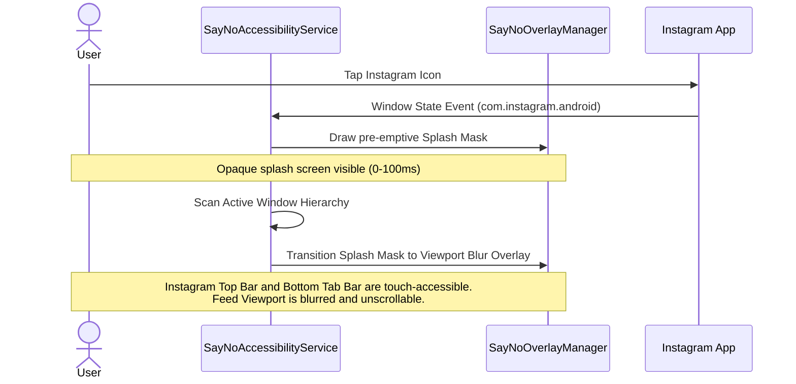
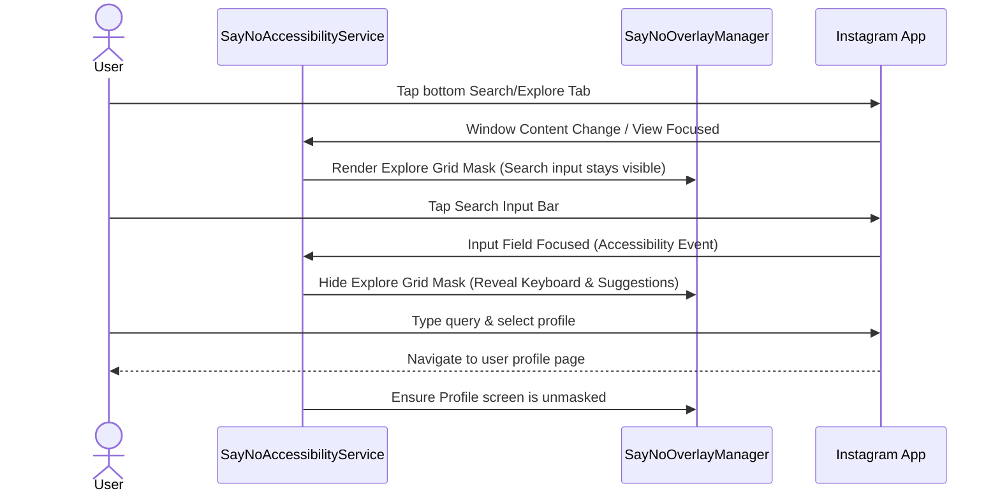
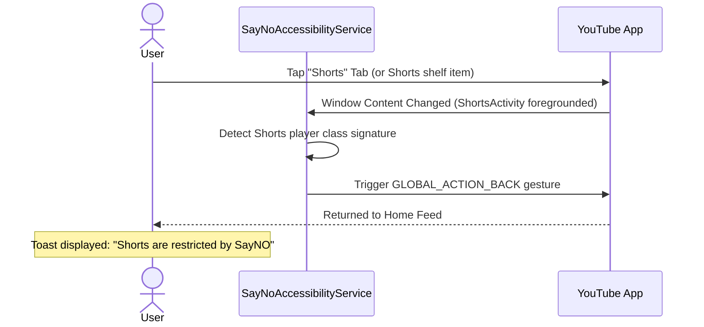
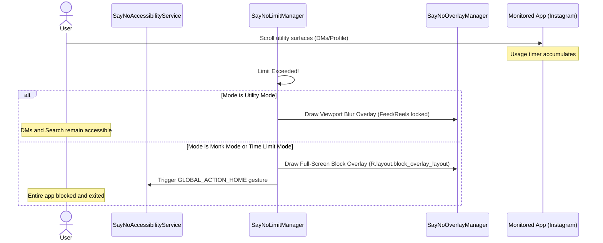

# Phase 6 Blueprint: Selective Friction Layer

## 1. Objective
The objective of **Phase 6: Selective Friction Layer** is to transition SayNO's blocking mechanics from broad, app-level ejections to surgical, surface-specific interventions. By separating the **highly addictive infinite-scroll content surfaces** from **essential communication and search utilities**, Phase 6 enables users to maintain vital digital access while blocking compulsive consumption triggers.

Specifically, it implements app-specific masking/blurring over the Instagram Feed, Reels, and Explore grid, and eliminates YouTube Shorts access, while preserving DMs, search tools, profiles, and normal long-form video consumption.

---

## 2. Philosophy
* **Surgical Granularity**: A user should not be locked out of messaging a family member or coordinating a meeting (DMs) just because the host app (Instagram) has an addictive feed. Friction must be applied directly to the addictive loop, not the utility.
* **Fail-Secure Access**: When a protected app is opened, the system must default to a *blocked state* (a pre-emptive splash overlay) and only reveal the interface once accessibility inspection confirms the target screen is a permitted utility area. This prevents the "startup flash" of addictive imagery.
* **Cognitive Interruption**: The selective friction overlay is designed as a persistent physical barrier. The user can see that utility tools exist but is visually and interactively barred from binging on algorithmically served feeds.
* **Retention through Utility**: Allowing users access to productive or communication-oriented sections of apps significantly reduces friction fatigue, preventing impulsive deactivation or uninstallation of SayNO.

---

## 3. Modules

### Module A: Pre-emptive App-Entry Lock (Visual Splash Mask)
* **Purpose**: Eliminate the visual "leakage window" (startup flash) where feed content is briefly visible for 100ms–200ms during cold or warm launches before accessibility nodes are processed.
* **Core Mechanisms**:
  1. **Foreground Handshake**: The native Kotlin [SayNoAccessibilityService](file:///d:/sayno-main-phase-1/android/app/src/main/kotlin/com/example/sayno/SayNoAccessibilityService.kt) captures package changes (`TYPE_WINDOW_STATE_CHANGED`) the instant a package matching `com.instagram.android` transitions to the foreground.
  2. **Instant Splash Screen**: Before any tree traversal is executed, [SayNoOverlayManager](file:///d:/sayno-main-phase-1/android/app/src/main/kotlin/com/example/sayno/SayNoOverlayManager.kt) draws a styled, full-screen, opaque visual splash overlay.
  3. **Verification Transition**: 
     - If the service detects that the user is launching a utility activity (e.g. from a deep link directly into DMs), the splash mask is instantly dismissed.
     - Otherwise, the splash mask fades smoothly into the viewport-restricted feed mask.

### Module B: Viewport-Constrained Masking (Instagram Feed)
* **Purpose**: Mask/blur the Instagram scrollable Feed viewport while keeping the top header (DMs) and bottom navigation bar (Search/Profile/Settings) interactive.
* **Core Mechanisms**:
  1. **Pass-Through Layout Flags**: Position a custom native window overlay using `WindowManager.LayoutParams.FLAG_NOT_TOUCH_MODAL` and `FLAG_NOT_FOCUSABLE`.
  2. **Dynamic Height Mask**: Construct a single layout containing:
     - **Top Box (Transparent)**: Matches the Instagram top header height (~56dp). Touches pass through to the Direct Messages icon.
     - **Middle Viewport Box (Opaque/Blurred)**: Intercepts all scroll and swipe events, displaying the SayNO lock message.
     - **Bottom Box (Transparent)**: Matches the bottom navigation bar height (~56dp). Touches pass through to Search, Profile, and Settings tabs.

### Module C: State-Aware Dynamic Search/Explore Masking
* **Purpose**: Block the infinite Explore grid while keeping the search query interface functional inside Instagram's unified search screen.
* **Core Mechanisms**:
  1. **Default Masking State**: When the Search/Explore tab is opened, the screen below the top search bar is masked.
  2. **Focus-Based Hiding**: The accessibility service listens for focus transitions (`AccessibilityEvent.TYPE_VIEW_FOCUSED`). When the search input field is actively focused by the user (keyboard visible, suggestions list active), the mask is hidden.
  3. **Focus-Lost Restoration**: As soon as search focus is lost (keyboard dismissed, search cleared, back gesture executed), the mask is immediately re-applied.

### Module D: YouTube Shorts Eradication (Dual-Gate)
* **Purpose**: Surgical removal of YouTube Shorts while leaving Home, Search, and standard long-form videos fully accessible.
* **Core Mechanisms**:
  1. **Gate 1: Click Interception**: Block navigation attempts on the "Shorts" bottom navigation tab and horizontal Shorts shelves on the Home Feed.
  2. **Gate 2: Fail-Safe Ejection**: If a user opens a Short (e.g. via direct web link or search result), the accessibility service intercepts the window state changes. The moment a window matching the YouTube Shorts player class name (`ShortsActivity`) or hierarchy is loaded, the service executes a `GLOBAL_ACTION_BACK` gesture or displays a block screen.

### Module E: Multi-Mode Configuration Engine
* **Purpose**: Support the four distinct restriction modes to align with various discipline strategies.
* **State Definitions**:
  1. **Utility Mode**:
     - *Before Limit*: App behaves normally (Reels, Feed, Explore are open).
     - *After Limit*: Feed, Reels, and Explore are blocked; DMs, Search, Profile, and Settings remain fully accessible.
  2. **Time Limit Mode** (Phase 3 Standard):
     - *Before Limit*: Entire app is open.
     - *After Limit*: The entire app is blocked (including DMs, Search, and Profiles).
  3. **Focus Mode**:
     - *Always*: Feed, Reels, Explore, and Shorts are blocked.
     - *Always*: DMs, Search, Profiles, and normal long-form videos are open.
     - *Limit*: No daily limit is configured.
  4. **Monk Mode**:
     - *Always*: Feed, Reels, Explore, and Shorts are blocked.
     - *Before Limit*: DMs, Search, Profiles, and normal long-form videos are open.
     - *After Limit*: The entire app is blocked (including DMs, Search, and Profiles).

---

## 4. User Flows

### Flow 1: Instagram Startup and Viewport Masking (Utility/Monk Mode)


### Flow 2: Transitioning to Search/Explore Tab (Focus/Monk Mode)


### Flow 3: YouTube Shorts Click and Fail-Safe Ejection


### Flow 4: Daily Limit Exhaustion (Utility Mode vs Monk Mode)


---

## 5. Technical Notes

### Kotlin (Native Android Protection Engine)
* **Element Detection Strategies & Candidate Signals**:
  The native layout scanner must dynamically query multiple properties to identify surfaces, using prioritized fallback paths rather than a single hardcoded identifier:
  - **Instagram Feed Viewport Detection**: 
    * *Candidate Signals*: Class names like `androidx.recyclerview.widget.RecyclerView` or `android.widget.ListView` inside screens that lack search cancel headers or direct thread wrappers.
    * *Selector Example*: Parent containers matching typical view container ids (e.g. `com.instagram.android:id/layout_container_main` or `com.instagram.android:id/container_root`), or layout paths matching a root-level vertical sequence.
    * *Fallback Strategy*: If resource IDs are obfuscated, evaluate structural node shapes (e.g., a scrollable view spanning the central 80% vertical height of the screen).
  - **Instagram Reels/Explore Tab Identification**: 
    * *Candidate Signals*: Bottom tab bars containing children with content descriptions (e.g., "Search and Explore", "Reels") or child indexes corresponding to the navigation tabs (e.g., index `1` or `3`).
    * *Fallback Strategy*: If indexes/descriptions change, inspect active child bounds or match layout content items.
  - **YouTube Shorts Player**:
    * *Candidate Signals*: Window class names (e.g. `com.google.android.apps.youtube.app.extensions.shorts.viewer.ShortsActivity`), or node hierarchies containing text description matching "Shorts player", "Shorts container", or action buttons like "Remix", "Dislike".
    * *Fallback Strategy*: Check standard action button patterns if activity names get obfuscated.
* **Overlay Pass-Through Flags**:
  - Apply `WindowManager.LayoutParams.FLAG_NOT_TOUCH_MODAL` and `FLAG_NOT_FOCUSABLE` to the viewport mask overlay window.
  - Position the viewport mask container using screen-coordinate offsets derived from system window insets (accounting for Status Bar and Navigation Bar heights).
* **Mode Synchronization & Post-Limit Tracking**:
  - Extend [SayNoConfigManager](file:///d:/sayno-main-phase-1/android/app/src/main/kotlin/com/example/sayno/SayNoConfigManager.kt) to store the active `RestrictionMode` for each package in native `SharedPreferences` (`sayno_config`).
  - [SayNoInterventionManager](file:///d:/sayno-main-phase-1/android/app/src/main/kotlin/com/example/sayno/SayNoInterventionManager.kt) reads this mode configuration on app foreground events and executes the matching layout overlays or back actions.
  - **Limit Manager Continuation**: Update [SayNoLimitManager](file:///d:/sayno-main-phase-1/android/app/src/main/kotlin/com/example/sayno/SayNoLimitManager.kt) behavior: if the active app's restriction mode is `Utility`, the limit checking handler loop must **not** invoke `stopChecking()` or terminate session tracking when the limit is exceeded. The overlay is drawn, but background usage accumulation continues so that time spent in allowed utility viewports (e.g. DMs, Search) continues contributing to the daily usage statistics. For non-utility modes (`Time Limit`, `Monk`), standard behavior applies (stopping session tracking and ejecting/blocking the user completely).

### Dart (Flutter Application Layer)
* **Database Schema Extension**:
  - Update the contract storage table structure inside [SessionDatabase](file:///d:/sayno-main-phase-1/lib/features/protection/data/session_database.dart) to associate the restriction mode with the specific contract app settings:
    ```sql
    ALTER TABLE contract_apps ADD COLUMN restriction_mode TEXT DEFAULT 'time_limit';
    ```
* **Domain Model Modification**:
  - Extend [ContractApp](file:///d:/sayno-main-phase-1/lib/features/contract/domain/contract_app.dart) to hold the configured mode enum:
    ```dart
    enum RestrictionMode { utility, timeLimit, focus, monk }
    ```
* **Flutter Settings Integration**:
  - Update UI to allow configuring the `RestrictionMode` when setting or modifying app limits during contract creation.
  - Sync the updated mode parameters down to the Kotlin Accessibility Service using [ProtectionPlatformService](file:///d:/sayno-main-phase-1/lib/features/protection/data/protection_platform_service.dart).

---

## 6. Success Criteria
Phase 6 is complete when the following verification checkpoints are satisfied:

* [ ] **Pre-emptive Splash Lock**: Cold launching Instagram displays the dark SayNO splash screen instantly, preventing any feed images from flashing.
* [ ] **Instagram Feed Masking**: Opening the home feed renders the viewport blur, blocking feed scrolls while DMs and bottom tabs remain 100% interactive.
* [ ] **Explore/Search Tab Gating**: Tapping Search/Explore tab displays the blur overlay. Actively tapping the Search Bar hides the blur to allow typing, and dismissing the keyboard restores the blur.
* [ ] **Instagram Reels Blocked**: Tapping the Reels tab or directly launching a Reels URL triggers an immediate back gesture and returns the user to the Feed/DMs.
* [ ] **YouTube Shorts Eradication**: Tapping the "Shorts" tab on YouTube triggers a back gesture. Launching a Shorts viewer via search/links triggers an immediate back gesture.
* [ ] **Monolithic Block (Time Limit/Monk)**: Once the contract daily limit is reached in Monk or Time Limit mode, the entire app is blocked, and access is refused.
* [ ] **Selective Lock (Utility)**: Once the contract daily limit is reached in Utility mode, the Instagram feed/Explore/Reels are blocked, but DMs and Search remain accessible.

---

## 7. MVP Scope vs. Future Expansion

### MVP Scope (Locked)
* **Target Apps**: Instagram (Official Android client) and YouTube (Official Android client).
* **Interventions**: Full-Screen Splash Overlay, Viewport-Constrained Mask Overlay, Node-based Search Input Focus tracking, and Activity-based player ejection (Shorts).
* **Modes**: Enforce the 4 modes (Utility, Time Limit, Focus, Monk) using static layout definitions.

### Future Expansion (Out of Scope)
* **Browser-based selective blocking**: Attempting to block Shorts/Reels on mobile browsers (Chrome, Firefox) will not be supported in MVP.
* **Auto-update Layout Registry**: Downloading layout templates from a remote server to recover from YouTube/Instagram updates will be implemented in a subsequent Future Phase.
* **Image/Text AI Scanning on Feed**: Running local neural networks to selectively block posts containing specific keywords/categories on the feed is out of scope for Phase 6.
