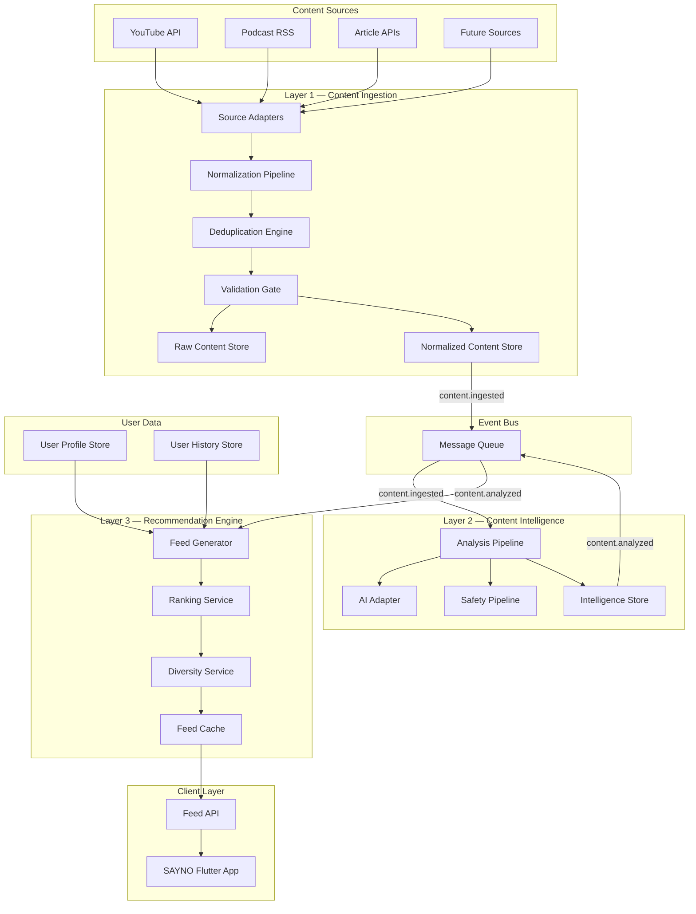
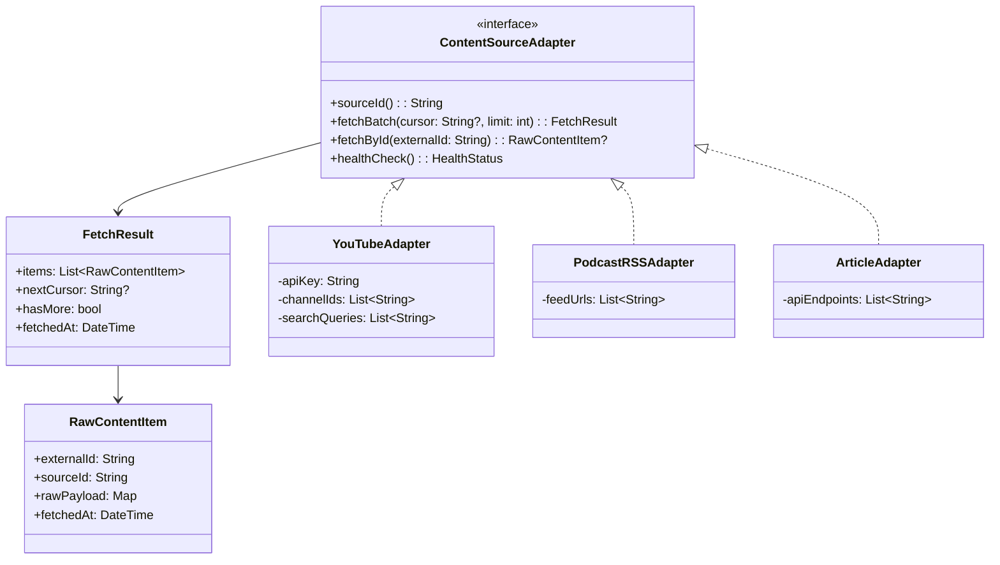
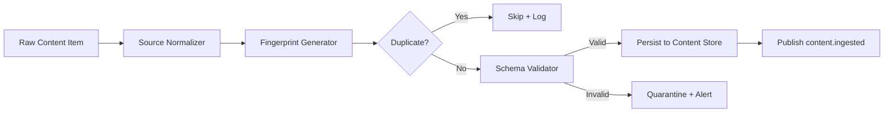
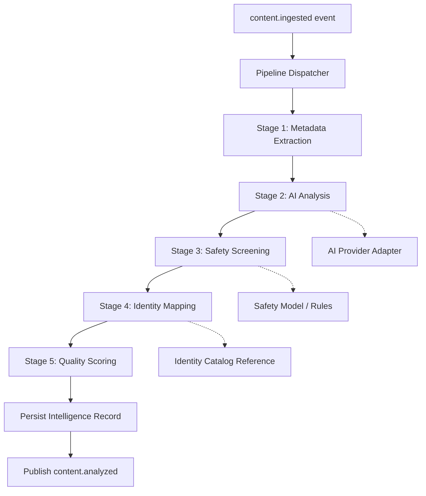
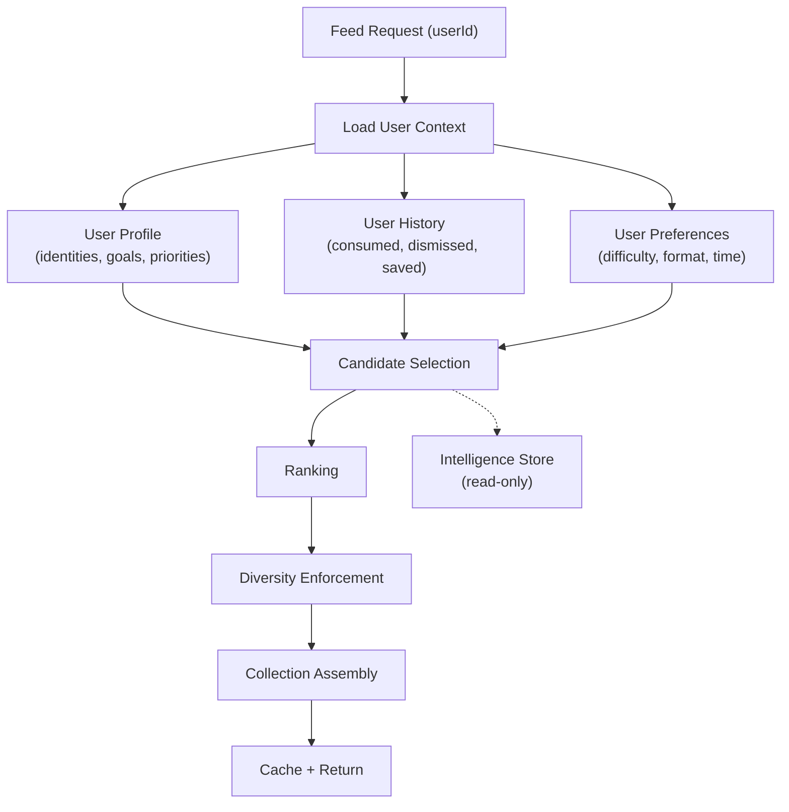
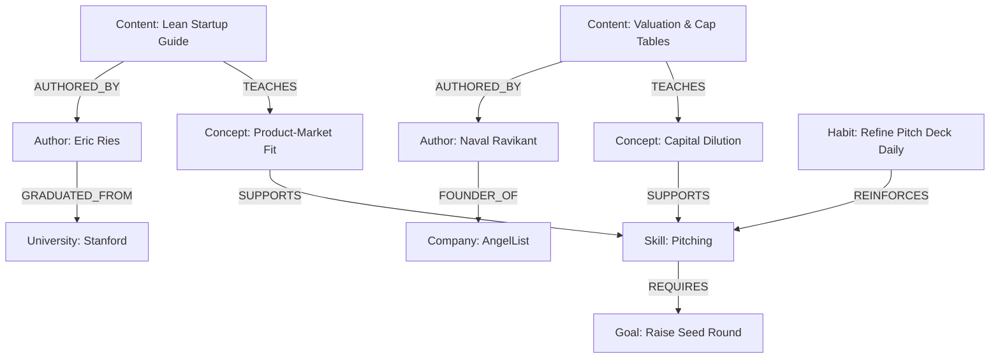
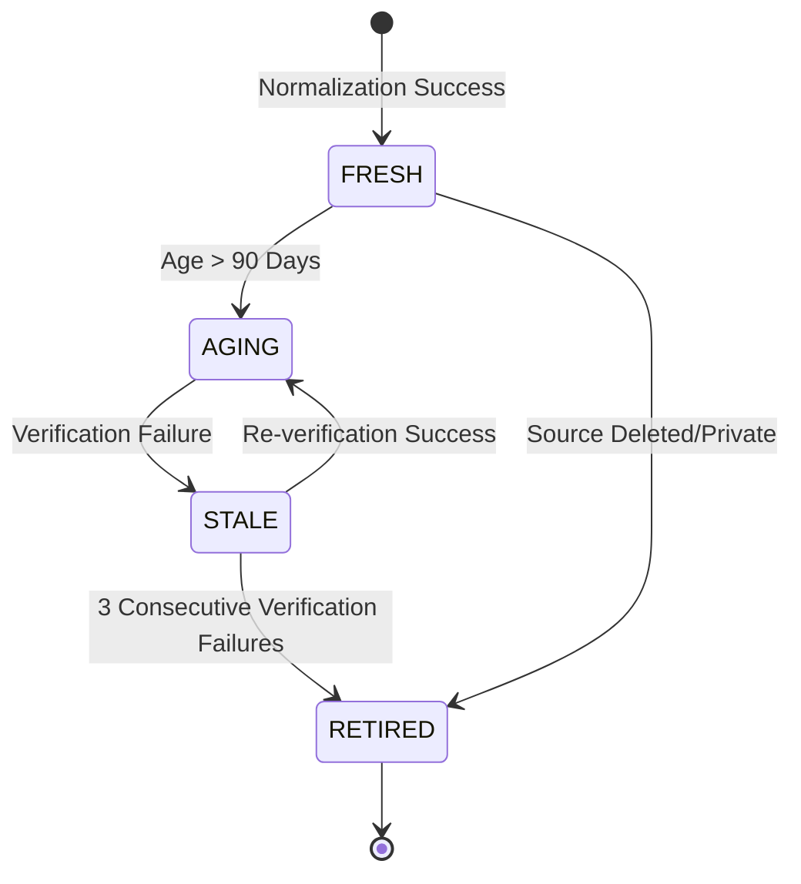
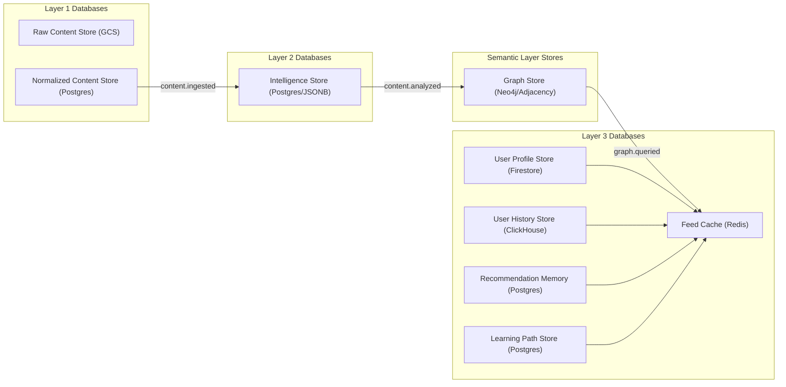
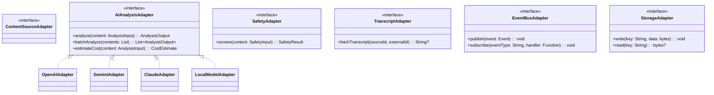
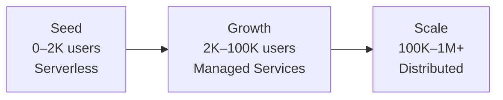

# SAYNO Universal Content Engine (UCE)
## Architecture & Software Design Specification

**Version:** 2.0  
**Status:** Draft — Pending Founder Review  
**Author:** Lead Software Architect  
**Date:** 2026-07-18  
**Revision:** v2 — Architectural Hardening (Identity Graph, Knowledge Graph, Content Lifecycle, Learning Paths, Trust Framework, Feedback Loop, Identity Evolution, Recommendation Memory, AI Governance)  

---

> [!IMPORTANT]
> This document is the engineering blueprint for SAYNO's core competitive advantage. Every architectural decision herein is made with a single question: *Does this help users become who they aspire to be?* Any decision that optimizes for engagement over transformation is a design failure.

---

## Table of Contents

1. [Vision & Philosophy](#1-vision--philosophy)
2. [System Goals](#2-system-goals)
3. [Non-Goals](#3-non-goals)
4. [Functional Requirements](#4-functional-requirements)
5. [Non-Functional Requirements](#5-non-functional-requirements)
6. [High-Level Architecture](#6-high-level-architecture)
7. [Layer 1 — Content Ingestion](#7-layer-1--content-ingestion)
8. [Layer 2 — Content Intelligence](#8-layer-2--content-intelligence)
9. [Layer 3 — Recommendation Engine](#9-layer-3--recommendation-engine)
10. [Identity & Knowledge Graph](#10-identity--knowledge-graph) *(v2)*
11. [Universal Content Schema](#11-universal-content-schema)
12. [Layer Contracts & Event-Driven Communication](#12-layer-contracts--event-driven-communication)
13. [Content Lifecycle Management](#13-content-lifecycle-management) *(v2)*
14. [Database Design](#14-database-design)
15. [Adapter & Plugin Architecture](#15-adapter--plugin-architecture)
16. [Learning Path Engine](#16-learning-path-engine) *(v2)*
17. [AI Governance & Model Lifecycle](#17-ai-governance--model-lifecycle) *(v2)*
18. [AI Strategy](#18-ai-strategy)
19. [Recommendation Strategy](#19-recommendation-strategy)
20. [Scalability Strategy](#20-scalability-strategy)
21. [Reliability & Fault Tolerance](#21-reliability--fault-tolerance)
22. [Security Considerations](#22-security-considerations)
23. [Monitoring & Observability](#23-monitoring--observability)
24. [Cost Optimization Strategy](#24-cost-optimization-strategy)
25. [Testing Strategy](#25-testing-strategy)
26. [Future Expansion Strategy](#26-future-expansion-strategy)
27. [Engineering Decisions & Trade-offs](#27-engineering-decisions--trade-offs)
28. [Integration with Existing SAYNO App](#28-integration-with-existing-sayno-app)
29. [Appendix](#29-appendix)

---

## 1. Vision & Philosophy

### 1.1 The Problem

Every major content platform—YouTube, TikTok, Instagram, Twitter—is an **engagement-maximization engine**. Their recommendation algorithms are optimized for one metric: *time spent on platform*. The content that keeps you scrolling is the content that gets promoted, regardless of whether it serves your long-term interests.

This creates a fundamental misalignment. The platform profits when you waste time. The user suffers.

### 1.2 SAYNO's Counter-Position

SAYNO does not block distractions. Blocking is a willpower-based strategy, and willpower is a finite resource.

Instead, SAYNO **replaces** low-value content consumption with high-value content consumption, aligned with who the user is actively choosing to become.

The Universal Content Engine is the technology that makes this possible. It is not a recommendation system in the traditional sense. It is a **transformation engine** — a system whose optimization function is the user's progress toward their declared future identity.

### 1.3 Design Philosophy

| Principle | Meaning |
|---|---|
| **Identity-First** | Every recommendation begins with who the user wants to be, not what they clicked on last. |
| **Transformation over Engagement** | We optimize for learning, skill acquisition, and personal growth — not watch time or session duration. |
| **Intentional Consumption** | The system should encourage users to consume fewer, higher-quality pieces of content rather than more. |
| **Process Once, Serve Forever** | AI analyzes content at ingestion time. User-facing feed generation never invokes an LLM per request. |
| **Layer Sovereignty** | Each layer has exactly one responsibility. Cross-layer coupling is a structural defect. |
| **Provider Agnosticism** | No single external dependency (AI model, content source, cloud provider) should be load-bearing. |
| **Cost as Architecture** | Cost optimization is not a post-launch concern. It is a first-class architectural constraint. |

### 1.4 What This System Is Not

- It is **not a social feed**. There are no likes, comments, shares, or follower counts.
- It is **not an endless scroll**. Content is served in finite, curated collections.
- It is **not a search engine**. Users do not query for content. Content finds them.
- It is **not a content creation platform**. SAYNO aggregates and curates, it does not host original content.
- It is **not a content marketplace**. There is no monetization of individual content items.

---

## 2. System Goals

### 2.1 Primary Goals

| ID | Goal | Success Metric |
|---|---|---|
| G-1 | Deliver identity-aligned content to every authenticated user | >85% of served content maps to at least one of the user's declared identities or goals |
| G-2 | Process content intelligence at ingestion time, not request time | 0 LLM calls in the feed generation hot path |
| G-3 | Support replacement of any AI provider without architectural change | AI provider swap requires changes to exactly one adapter class |
| G-4 | Scale from 2,000 to 1M+ users without architectural rewrites | Same core system handles 500x traffic increase via configuration, not redesign |
| G-5 | Generate a personalized feed in <200ms at P99 | Feed generation reads pre-computed intelligence, never invokes external AI |
| G-6 | Ingest content from multiple sources through a single pipeline | Adding a new content source requires writing one adapter, zero pipeline changes |

### 2.2 Secondary Goals

| ID | Goal | Rationale |
|---|---|---|
| G-7 | Support content quality degradation gracefully | If AI intelligence is unavailable, the system should still serve content using fallback heuristics |
| G-8 | Enable content moderation before user exposure | No content reaches a user without passing safety checks |
| G-9 | Support offline-first mobile consumption | Pre-fetched feed data is available without network connectivity |
| G-10 | Provide explainability for recommendations | The system can articulate *why* a specific piece of content was recommended to a specific user |

---

## 3. Non-Goals

| ID | Explicitly Not Building | Reason |
|---|---|---|
| NG-1 | Real-time content streaming / hosting | SAYNO curates; it does not host. Content is consumed on the source platform (YouTube, etc.) |
| NG-2 | User-generated content | This is not a social platform. Users consume, they do not produce within SAYNO. |
| NG-3 | Collaborative filtering ("users like you also watched") | Traditional collaborative filtering optimizes for engagement. We use identity-based filtering instead. |
| NG-4 | Real-time AI inference per user request | Every AI computation happens asynchronously at ingestion/intelligence time. |
| NG-5 | Content creator dashboard or analytics | SAYNO has no relationship with content creators. |
| NG-6 | Advertising or sponsored content | Content integrity is non-negotiable. No paid placement, ever. |
| NG-7 | Full-text content indexing / search | Users discover content through identity-aligned curation, not keyword search. |

---

## 4. Functional Requirements

### 4.1 Content Ingestion (Layer 1)

| ID | Requirement |
|---|---|
| FR-1.1 | The system SHALL ingest content from YouTube via the YouTube Data API v3. |
| FR-1.2 | The system SHALL support additional content sources (podcasts, articles, courses) through a pluggable adapter interface. |
| FR-1.3 | The system SHALL normalize all ingested content into a Universal Content Schema regardless of source. |
| FR-1.4 | The system SHALL detect and reject duplicate content using content fingerprinting. |
| FR-1.5 | The system SHALL validate ingested content against schema constraints before persisting. |
| FR-1.6 | The system SHALL publish a `content.ingested` event for every successfully processed content item. |
| FR-1.7 | The system SHALL support both scheduled batch ingestion and on-demand ingestion triggers. |
| FR-1.8 | The system SHALL retain raw source data alongside normalized data for auditability. |

### 4.2 Content Intelligence (Layer 2)

| ID | Requirement |
|---|---|
| FR-2.1 | The system SHALL assign one or more categories to each content item. |
| FR-2.2 | The system SHALL extract topic tags from content metadata and (where available) transcript. |
| FR-2.3 | The system SHALL map content to one or more SAYNO identity profiles (e.g., Entrepreneur, Student, Developer). |
| FR-2.4 | The system SHALL assign a quality score (0.0–1.0) to each content item. |
| FR-2.5 | The system SHALL determine content difficulty level (Beginner, Intermediate, Advanced, Expert). |
| FR-2.6 | The system SHALL detect potential clickbait, toxicity, and misinformation indicators. |
| FR-2.7 | The system SHALL generate a short summary (≤150 words) and key takeaways (≤5 items) for each content item. |
| FR-2.8 | The system SHALL detect the primary language of the content. |
| FR-2.9 | The system SHALL estimate educational value on a scale (entertainment → informational → educational → transformational). |
| FR-2.10 | The system SHALL extract skills that the content teaches or develops. |
| FR-2.11 | The system SHALL publish a `content.analyzed` event for every successfully analyzed content item. |
| FR-2.12 | The system SHALL store all intelligence output as a structured Intelligence Record, immutably linked to the content item. |

### 4.3 Recommendation Engine (Layer 3)

| ID | Requirement |
|---|---|
| FR-3.1 | The system SHALL generate a personalized feed of content collections given a user's identity configuration. |
| FR-3.2 | The system SHALL rank content by relevance to the user's identities, goals, and priority ordering. |
| FR-3.3 | The system SHALL enforce diversity across content types, topics, and difficulty levels within a single feed. |
| FR-3.4 | The system SHALL handle cold-start users (no history) using identity and goal signals alone. |
| FR-3.5 | The system SHALL deprioritize content the user has already consumed or explicitly dismissed. |
| FR-3.6 | The system SHALL balance exploration (new topics) with exploitation (known interests). |
| FR-3.7 | The system SHALL refresh feed content periodically, not on every request. |
| FR-3.8 | The system SHALL exclude any content flagged by the safety pipeline. |
| FR-3.9 | The system SHALL support "Continue Learning" collections that track user progress across content. |

---

## 5. Non-Functional Requirements

| ID | Requirement | Target |
|---|---|---|
| NFR-1 | Feed generation latency (P99) | < 200ms |
| NFR-2 | Content ingestion throughput | ≥ 1,000 items/hour |
| NFR-3 | Content intelligence processing time per item | < 30 seconds average |
| NFR-4 | System availability | 99.5% uptime (ingestion can tolerate brief outages; feed serving must be highly available) |
| NFR-5 | Data retention for raw content | ≥ 12 months |
| NFR-6 | Intelligence re-processing capability | Any content item can be re-analyzed with a new model version within 24 hours of trigger |
| NFR-7 | Horizontal scalability | Each layer scales independently |
| NFR-8 | AI provider swap time | < 1 engineering day to swap the active AI provider |
| NFR-9 | New source adapter development time | < 3 engineering days to add a new content source |
| NFR-10 | Content safety filtering | 100% of content passes safety checks before user exposure |

---

## 6. High-Level Architecture

### 6.1 System Overview



### 6.2 Architectural Principles

| Principle | Implementation |
|---|---|
| **Single Responsibility per Layer** | Layer 1 fetches and normalizes. Layer 2 understands. Layer 3 recommends. No exceptions. |
| **Event-Driven Decoupling** | Layers communicate exclusively through events on a message bus. No direct function calls across layer boundaries. |
| **Shared-Nothing Databases** | Each layer owns its own data store. No cross-layer database access. |
| **Adapter Pattern Everywhere** | External dependencies (AI providers, content sources, databases) are accessed exclusively through adapter interfaces. |
| **Idempotent Operations** | Every pipeline stage can be safely re-executed without producing duplicate side effects. |
| **Graceful Degradation** | If Layer 2 is down, Layer 1 continues ingesting. If Layer 2 is incomplete, Layer 3 falls back to metadata-only ranking. |

### 6.3 Deployment Topology

For the initial 2,000-user phase, the entire UCE runs as a set of **Cloud Functions / serverless workers** behind a lightweight API gateway. As scale increases, individual layers can be extracted into dedicated services without changing the internal architecture.

| Scale Tier | Users | Deployment Model |
|---|---|---|
| **Seed** | 0–2,000 | Monorepo, Cloud Functions, single database instance |
| **Growth** | 2,000–100,000 | Separated services per layer, managed message queue, read replicas |
| **Scale** | 100,000–1M+ | Microservices, dedicated search index, sharded databases, CDN-backed feed cache |

---

## 7. Layer 1 — Content Ingestion

### 7.1 Responsibilities

Layer 1 is the system's **data acquisition layer**. Its sole purpose is to find content in the external world, bring it into the SAYNO domain, and make it available for downstream processing. It has zero knowledge of what the content means or who it should be served to.

### 7.2 Source Adapter Architecture



**Key Design Decisions:**

- Every adapter implements the same `ContentSourceAdapter` interface.
- Adapters are **cursor-based** for efficient pagination and resumable fetching.
- Raw payloads are stored verbatim — no data is discarded at the adapter level.
- Each adapter reports its own health status for monitoring.

### 7.3 Normalization Pipeline

Once raw content is fetched, the Normalization Pipeline transforms source-specific data into the Universal Content Schema (defined in §10).



Each content source has a corresponding **Normalizer** — a pure function that maps the source-specific raw payload to the Universal Content Schema. Normalizers are the only place where source-specific field mappings exist.

### 7.4 Deduplication Strategy

Duplicate detection operates at two levels:

| Level | Method | Purpose |
|---|---|---|
| **Exact** | SHA-256 hash of `(sourceId, externalId)` | Prevents re-ingesting the same item from the same source |
| **Fuzzy** | SimHash of `(title + description)` with Hamming distance ≤ 3 | Catches near-duplicate content across sources (e.g., the same lecture uploaded to two channels) |

### 7.5 Ingestion Scheduling

| Mode | Trigger | Use Case |
|---|---|---|
| **Scheduled Batch** | Cron job (configurable per source, default: every 6 hours) | Primary ingestion mode for all sources |
| **On-Demand** | Admin API call or identity catalog update event | When new identities/goals are added to the catalog, trigger a targeted fetch for related content |
| **Backfill** | One-time manual trigger with date range | Populating the system with historical content for a new source |

### 7.6 Failure Handling

| Failure Mode | Handling |
|---|---|
| Source API down | Exponential backoff with jitter; retry up to 5 times; alert after 3rd failure |
| Rate limiting | Respect `Retry-After` headers; spread requests across time windows |
| Malformed response | Quarantine the item; log the raw payload for debugging; continue processing remaining items |
| Normalization error | Quarantine with error context; do not publish `content.ingested` |
| Database write failure | Retry with idempotency key; dead-letter after 3 failures |

### 7.7 What Layer 1 Does NOT Do

- ❌ Analyze content meaning
- ❌ Score content quality
- ❌ Map content to identities
- ❌ Rank or sort content
- ❌ Invoke any AI/ML model
- ❌ Read from or write to the User Profile Store
- ❌ Know anything about user identities or goals

---

## 8. Layer 2 — Content Intelligence

### 8.1 Responsibilities

Layer 2 is the system's **understanding layer**. It receives raw normalized content and produces a rich, structured Intelligence Record that captures everything the system needs to know about the content's meaning, quality, safety, and educational value.

This is the only layer that interacts with AI/ML models.

### 8.2 Analysis Pipeline Architecture



### 8.3 Pipeline Stages

#### Stage 1: Metadata Extraction (No AI)

Extracts structured signals from the content's existing metadata without invoking AI:

| Signal | Source | Method |
|---|---|---|
| Duration | Source metadata | Direct extraction |
| Language | Title + description | Language detection library (e.g., `langdetect`) |
| Publication date | Source metadata | Direct extraction |
| Channel/author reputation | Subscriber count, follower count, publication history | Heuristic scoring |
| Content format | Source type + metadata | Rule-based classification (video, podcast, article, course) |

**Why this stage exists separately:** These signals are deterministic, fast, and free. Extracting them before the AI stage means we can use them as inputs to the AI prompt (improving accuracy) and as fallback signals if the AI stage fails.

#### Stage 2: AI Analysis (Core Intelligence)

This is the primary AI-powered stage. A single, well-structured prompt is sent to the AI provider with the content's title, description, transcript (if available), tags, and Stage 1 metadata.

**AI Output Schema (requested from the model):**

```json
{
  "categories": ["Technology", "Business"],
  "topics": ["Product Management", "Startup Strategy", "User Research"],
  "skills": ["Problem Solving", "Customer Development", "Market Analysis"],
  "difficulty": "Intermediate",
  "educationalValue": "educational",
  "summary": "A comprehensive guide to validating startup ideas...",
  "keyTakeaways": [
    "Talk to customers before building",
    "Measure willingness to pay, not interest",
    "Build the smallest thing that tests your riskiest assumption"
  ],
  "estimatedLearningTime": "20 minutes",
  "contentType": "tutorial",
  "clickbaitScore": 0.15,
  "confidence": 0.87
}
```

**Critical Design Decision:** The AI is invoked **exactly once per content item**, at ingestion time. The structured output is stored permanently. No downstream system ever calls the AI model again for this content item.

#### Stage 3: Content Trust & Credibility Framework

Safety is a baseline requirement, but a long-term transformational system requires a comprehensive evaluation of content trustworthiness and credibility. Stage 3 is structured into three processing tiers:

1. **Tier 1 — Deterministic Safety Rules:** Direct blocklist checks for toxic channels, domain reputation lists, and keyword matching. Malformed or flagged content is immediately routed to the `BLOCKED` status.
2. **Tier 2 — AI-Assisted Safety Evaluation:** Extracted directly from the Stage 2 AI analysis payload. The AI assesses clickbait scores, potential misinformation indicators, factual consistency, and age-appropriateness.
3. **Tier 3 — Source Credibility Profiling:** The system computes a dynamic **Trust Score** (0.0–1.0) for every content creator, channel, or publishing company:
   $$Trust(Author) = w_1 \cdot Consistency + w_2 \cdot Reputation + w_3 \cdot HistoricalQuality + w_4 \cdot SafetyRecord$$
   where:
   - *Consistency* measures domain adherence (does a startup channel suddenly post gaming videos?).
   - *Reputation* checks channel age, verification status, and historical subscriber/engagement ratios.
   - *HistoricalQuality* is the running average of quality scores assigned to this author's content.
   - *SafetyRecord* represents the proportion of items from this author that passed safety checks without being flagged.

**Trust Outcomes:**
- `TRUSTED`: Safety checks passed; Trust Score ≥ 0.60. Content proceeds to Stage 4.
- `PROVISIONAL`: Safety checks passed; Trust Score < 0.60. Content proceeds to Stage 4 but receives a ranking multiplier penalty (e.g., 0.8x).
- `REVIEW`: Ambiguous safety or credibility metrics. Content is quarantined for administrator manual evaluation.
- `BLOCKED`: Severe safety violations. Content is soft-deleted, logged for audit, and excluded from downstream queues.

#### Stage 4: Identity & Knowledge Graph Mapping

This stage places the analyzed content into the relational structure of the **Universal Identity Ontology and Knowledge Graph** (§10). It does not use AI; instead, it runs a deterministic graph-traversal and edge-writing pipeline:

1. **Ontological Alignment:** The content's extracted categories, topics, and skills are intersected with the ontology goals.
2. **Path Distance Mapping:** The engine computes the shortest path between the content's topics and active catalog goals:
   $$Relevance(Content, Goal) = \sum_{t \in Topics} \sum_{g \in Goals} \frac{RelevanceScore(t, g)}{1 + Distance(t, g)}$$
   where $Distance(t, g)$ is the path length in the Knowledge Graph.
3. **Graph Registration:** A new node representing the content item is written to the Knowledge Graph with edges:
   - `AUTHORED_BY` pointing to the Author node.
   - `TEACHES` pointing to the respective Skill and Concept nodes.
   - `REQUIRES` pointing to prerequisite concepts (determined by Stage 2 transcript analysis).
   - `SERVES` pointing to matching Goal nodes.

#### Stage 5: Quality Scoring

A composite quality score (0.0–1.0) is computed from multiple weighted signals:

| Signal | Weight | Source |
|---|---|---|
| AI confidence score | 0.10 | Stage 2 |
| Educational value level | 0.25 | Stage 2 |
| Clickbait inverse score | 0.15 | Stage 2 ($1.0 - clickbaitScore$) |
| Author Trust Score | 0.20 | Stage 3 Credibility Profiling |
| Content depth (duration × difficulty) | 0.15 | Stage 1 + Stage 2 |
| Graph mapping connectivity | 0.15 | Stage 4 (density of relationships in graph) |

The quality score formula is a **configuration**, not code. Weights are adjustable without redeployment.

### 8.4 Intelligence Record

The output of the full pipeline is an **Intelligence Record** — a structured document permanently associated with a content item:

```
IntelligenceRecord {
  contentId: String            // FK to Universal Content item
  version: Int                 // Incremented on re-analysis
  analyzedAt: DateTime
  modelId: String              // Which AI model produced this analysis
  
  // Stage 1
  detectedLanguage: String
  contentFormat: Enum
  channelReputationScore: Float
  
  // Stage 2
  categories: List<String>
  topics: List<String>
  skills: List<String>
  difficulty: Enum
  educationalValue: Enum
  summary: String
  keyTakeaways: List<String>
  estimatedLearningTime: Duration
  contentType: String
  clickbaitScore: Float
  aiConfidence: Float
  
  // Stage 3
  safetyStatus: Enum
  safetyFlags: List<String>
  
  // Stage 4
  identityMappings: List<{identityId, relevanceScore}>
  goalMappings: List<{goalId, relevanceScore}>
  
  // Stage 5
  qualityScore: Float
}
```

### 8.5 Re-Analysis Strategy

Content can be re-analyzed in the following scenarios:

| Trigger | Scope | What Changes |
|---|---|---|
| AI model upgrade | All content or sampled subset | Full re-analysis with new model version |
| Identity Catalog update | All content | Stage 4 (Identity Mapping) only — no AI re-invocation |
| Quality weight adjustment | All content | Stage 5 (Quality Scoring) only — pure recomputation |
| Manual review trigger | Single item | Full re-analysis |

### 8.6 What Layer 2 Does NOT Do

- ❌ Fetch content from external sources
- ❌ Rank content for any specific user
- ❌ Generate personalized feeds
- ❌ Read user profile or history data
- ❌ Decide which user sees which content
- ❌ Modify the raw or normalized content

---

## 9. Layer 3 — Recommendation Engine

### 9.1 Responsibilities

Layer 3 is the system's **personalization layer**. Given a user's identity configuration and behavioral history, it produces a ranked, diverse, finite feed of content collections.

### 9.2 Feed Generation Architecture



### 9.3 Feed Generation Pipeline

#### Phase 1: Candidate Selection

The candidate pool is constructed by querying the Intelligence Store using the user's identity and goal mappings:

```
candidates = SELECT content 
    FROM intelligence_store
    WHERE identityMappings OVERLAPS user.identityIds
      AND safetyStatus = 'SAFE'
      AND qualityScore >= MINIMUM_QUALITY_THRESHOLD
      AND contentId NOT IN user.consumedContentIds
      AND contentId NOT IN user.dismissedContentIds
    ORDER BY qualityScore DESC
    LIMIT CANDIDATE_POOL_SIZE  // e.g., 500
```

**Why a large candidate pool?** Selecting the top 500 candidates (rather than, say, 50) gives the Diversity and Exploration stages enough material to construct a genuinely varied feed.

#### Phase 2: Ranking

Each candidate receives a **Personalized Relevance Score (PRS)**:

```
PRS(content, user) = Σ(
    w₁ × identityRelevance(content, user.identities, user.priorities),
    w₂ × goalRelevance(content, user.goals),
    w₃ × difficultyMatch(content.difficulty, user.inferredLevel),
    w₄ × freshnessBoost(content.publishedAt),
    w₅ × qualityScore(content),
    w₆ × explorationBonus(content, user.history),
    w₇ × formatPreference(content.format, user.preferredFormats)
)
```

**Identity Priority Weighting:** The user's identity priority ordering directly affects ranking. If a user has set Entrepreneur as priority 1 and Student as priority 2, entrepreneur-relevant content receives a 1.5x multiplier while student content receives a 1.0x multiplier.

```
identityRelevance(content, identities, priorities) =
    MAX over matched identities: (
        content.relevanceToIdentity[id] × priorityMultiplier(identity.priority)
    )

priorityMultiplier(priority):
    1 → 1.50
    2 → 1.25
    3 → 1.10
    4 → 1.00
```

#### Phase 3: Diversity Enforcement

After ranking, a diversity pass ensures the feed is not monotonic:

| Diversity Dimension | Constraint |
|---|---|
| Identity | No single identity dominates >50% of feed items |
| Topic | No single topic appears in >3 consecutive items |
| Difficulty | Feed includes at least 2 difficulty levels |
| Content format | If multiple formats available, at least 2 formats represented |
| Source | No single channel/author dominates >25% of feed items |

The diversity algorithm uses a **greedy re-ranking** approach: iterate through the ranked list, and for each position, select the highest-ranked item that does not violate any diversity constraint.

#### Phase 4: Collection Assembly

The diversified content list is grouped into **Collections** — the primary UI unit in the SAYNO app:

| Collection Type | Assembly Logic |
|---|---|
| `continueLearning` | Content the user has partially consumed (tracked via User History) |
| `curated` | Top-ranked content for the user's highest-priority identity/goal |
| `featured` | Editorially pinned or highest-quality content across all identities |
| `explore` | Content from topics adjacent to the user's identities (exploration) |

This maps directly to the existing `CollectionType` enum in the SAYNO app: `continueLearning`, `curated`, `featured`, `explore`.

#### Phase 5: Caching

Generated feeds are cached with the following policy:

| Cache Key | `userId + identityConfigHash` |
|---|---|
| TTL | 4 hours (configurable) |
| Invalidation | On identity change, on explicit refresh, on significant new content ingestion |
| Storage | In-memory cache (Redis) at Growth tier; CDN edge cache at Scale tier |

### 9.4 Cold Start Strategy

For users with no consumption history:

1. **Identity signals are sufficient.** The user has selected identities and goals during onboarding. This is enough to generate a meaningful first feed.
2. **Priority ordering provides differentiation.** Even two users with the same identities will see different feeds if their priority ordering differs.
3. **Default difficulty: Beginner → Intermediate.** New users start with accessible content and are gradually moved to higher difficulty as engagement signals accumulate.
4. **Exploration bias: higher.** For cold-start users, the exploration bonus weight (w₆) is increased by 2x to help the system learn the user's preferences quickly.

### 9.5 Rich User Feedback Loop

The system operates a multi-tiered feedback loop that feeds into the User History Store and directly adjusts recommendation signals:

1. **Tier 1 — Implicit Signals (zero user friction):**
   - **Consumption Depth:** Calculated as the ratio of actual watch/read time to total content duration.
   - **Session Origin:** Tracks whether the user entered via a block-triggered replacement flow or opened the app intentionally.
   - **Engagement Velocity:** Time elapsed between displaying a feed and selecting a content item.
   - **Abandonment Rate:** Content opened but closed in under 10 seconds.
2. **Tier 2 — Lightweight Explicit Signals:**
   - **Dismissals:** Hitting "Not Interested" or choosing to skip/dismiss a collection.
   - **Saves:** Bookmarking or adding items to a personal reading list.
   - **Difficulty Verification:** Post-consumption prompt asking if the difficulty was "Too Easy", "Just Right", or "Too Challenging".
3. **Tier 3 — Rich Reflection Output:**
   - Text inputs collected during the post-replacement reflection flow, analyzed by asynchronous offline jobs to extract user sentiment, concept clarity, and behavioral commitments.

These signals aggregate in the User Profile Store to dynamically tune user-specific weights (e.g., shifting difficulty preferences and format bias).

### 9.6 Identity Evolution

Identity is not a static state; user aspirations evolve. The UCE contains an **Identity Evolution Module** that tracks and adapts to this drift over time:

1. **Drift Detection:** If a user consistently consumes and completes content in topics adjacent to their declared identities (e.g., an *Athlete* repeatedly choosing *Nutrition* and *Biology* concepts), the system logs a **Drift Vector**.
2. **Goal Saturation:** As a user completes all core content connected to a Goal, the system marks the Goal as **Saturated** and shifts feed generation toward next-stage goals or exploration categories.
3. **Identity Suggestion Engine:** Once a Drift Vector crosses a confidence threshold, the UCE publishes an `identity.evolution.detected` event, triggering the client app to prompt the user: *"We noticed you are exploring a lot of Software Engineering content. Would you like to add 'Developer' to your active identities?"*
4. **Historical Decay:** Engagement with older identities decays at a configurable half-life (e.g., 90 days of zero active selection), slowly reducing their ranking relevance unless re-confirmed by the user.

### 9.7 What Layer 3 Does NOT Do

- ❌ Fetch content from external sources
- ❌ Analyze content meaning
- ❌ Invoke any AI/ML model
- ❌ Modify content data or intelligence records
- ❌ Create new content entries
- ❌ Access raw content from Layer 1's store
- ❌ Force-change a user's declared identities without explicit confirmation

---

## 10. Identity & Knowledge Graph

The semantic foundation of the Universal Content Engine is the **Universal Identity Ontology** and its unified **Knowledge Graph** architecture. Instead of treating content tags as flat metadata strings, the system models human aspiration and knowledge as a highly connected, weighted, directional semantic network. This graph serves as the intelligence layer underneath the recommendation engine.

### 10.1 Universal Identity Ontology

The Ontology defines the rules, vocabulary, classes, and relationship types that govern the SAYNO ecosystem. It represents the structural map of how users grow and how information connects.

```
Universal Identity Ontology Hierarchy:

[Identity] ──── (directional vector of aspiration)
   │
   └── [Domain] ──── (broad industry or field of endeavor)
          │
          └── [Goal] ──── (concrete learning milestones)
                 │
                 └── [Skill] ──── (actionable/measurable capability)
                        │
                        └── [Concept] ──── (atomic mental model or unit of knowledge)
                               └── [Topic] ──── (subject matter grouping)
                                      └── [Habit] ──── (repetitive reinforcing loop)
                                             └── [Content] ──── (media asset instance)
```

#### Core Entities Defined:
1. **Identity:** A holistic, aspirational persona the user seeks to cultivate (e.g., *Entrepreneur*, *Athlete*, *Writer*, *Developer*). It is a directional vector of progress rather than a demographic label.
2. **Domain:** A broad industrial or intellectual sector (e.g., *Technology*, *Health & Fitness*, *Finance*, *Literature*).
3. **Goal:** A concrete, task-oriented milestone that supports an Identity (e.g., *Raise a Seed Round*, *Run a Marathon*, *Deploy a Production API*).
4. **Skill:** An acquirable, measurable capability required to achieve a Goal (e.g., *Cap Table Negotiation*, *Aerobic Base Building*, *Database Schema Design*).
5. **Concept:** An atomic, theoretical unit of knowledge or a mental model (e.g., *Dilution*, *VO2 Max*, *ACID Transactions*, *Network Effects*).
6. **Topic:** A thematic classification that aggregates related Concepts and Skills for indexing purposes (e.g., *Venture Capital*, *Endurance Running*, *Relational Databases*).
7. **Habit:** A repetitive behavioral loop designed to reinforce skill acquisition and solidify identity shift (e.g., *Cold emailing 5 prospects daily*, *Running 45 minutes at Zone 2 aerobic pace*, *Refactoring 100 lines of code daily*).
8. **Content:** The physical media asset that transmits Concepts and Skills (e.g., *a YouTube video*, *a podcast episode*, *an article*, *a book summary*).

#### Ontological Relationships & Semantic Hierarchy:
- **Hierarchical Parent-Child Relationships:** Relationships can be vertical (e.g., `Goal` has sub-goals, `Topic` has sub-topics) or structural (e.g., `Identity` -> `Domain` -> `Goal`).
- **Many-to-Many Mappings:** The ontology is a Directed Acyclic Graph (DAG), not a tree. The Skill *Negotiation* serves the Goal *Raise a Seed Round* (under *Entrepreneur*), but also serves *Close Enterprise Deal* (under *Salesperson*) and *Salary Review* (under *Job Seeker*).
- **Semantic Inheritance:** Subclasses inherit prerequisite requirements. If *Advanced Rust Concurrency* requires *Rust Memory Safety*, any goal mapping to Concurrency transitively inherits the memory safety requirement.
- **Ontology Evolution & Versioning:** The ontology is managed centrally as an event-sourced configuration asset. When the ontology is updated, the system publishes an `ontology.updated` event. Obsolete concepts are marked `DEPRECATED` (historical content remains mapped, but new content cannot target them) rather than deleted. Sibling concepts can be merged via an `IS_ALIAS_OF` edge.
- **Identity Lifecycle:** The system tracks user progress through four ontology states:
  1. *Latent/Discovered:* User explores content outside declared identities.
  2. *Declared (Active):* User explicitly commits to the identity during onboarding or evolution suggestion.
  3. *Mastered/Achieved:* User completes the core paths associated with the identity; recommendations shift from foundation concepts to cutting-edge topics.
  4. *Dormant:* A historically active identity that has been deselected or decays due to prolonged inactivity.

### 10.2 Knowledge Graph Architecture

If the Ontology is the grammar, the Knowledge Graph is the living database. It instantiates the ontology's classes as nodes and maps their direct relations via weighted, typed semantic edges.



#### Graph Nodes (Entities):
- **Aspirational Nodes:** `Identity`, `Domain`, `Goal`
- **Knowledge Nodes:** `Skill`, `Concept`, `Topic`
- **Behavioral Nodes:** `Habit`
- **Content Nodes:** Specialized subclasses: `Video` (YouTube, Vimeo), `Podcast` (Spotify, Apple), `Article` (Medium, Substack), `Book` (EPUB/PDF summary), `Course` (Coursera, Udemy), `Research Paper` (arXiv, PubMed).
- **Contextual Entity Nodes:** `Author` (creator), `Company` (publisher or sponsor), `University` (academic source).

#### Graph Edges (Semantic Relationships):
Edges are typed, directional, and contain weight coefficients in $[0.0, 1.0]$:
- `TEACHES` (Content -> Skill/Concept): Quantifies the density of educational value.
- `REQUIRES` (Skill/Concept -> Skill/Concept): Establishes strict prerequisite sequencing.
- `REINFORCES` (Habit -> Skill): Maps behavioral actions to target capabilities.
- `AUTHORED_BY` (Content -> Author): Connects content to creator nodes for authority tracking.
- `WORKS_AT` / `FOUNDER_OF` (Author -> Company): Links author credibility to institutional reputation.
- `GRADUATED_FROM` (Author -> University): Academic credential verification.
- `SERVES` (Goal -> Identity): Connects operational milestones back to high-level identities.

#### Graph Operations & Traversal:
- **Prerequisite Traversal (Topological Sort):** When a user requests a new topic, the system traverses `REQUIRES` edges backward to build a dependency tree. If a prerequisite node has not been consumed (measured in User History Store), it is injected into the feed first.
- **Personalized PageRank (Adjacent Node Discovery):** Drives discovery by performing random walks starting at the user's active graph nodes. This bubbles up concepts connected by short paths, even if they belong to different domains (e.g., connecting *Endurance Running* to *Startup Endurance*).
- **Similarity Search (Graph Embeddings):** Nodes are projected into a 128-dimensional embedding space using Node2Vec or GraphSAGE. Sibling content similarity is determined by cosine distance of their neighborhood embeddings rather than metadata keywords.
- **Dynamic Graph Enrichment:** As Layer 2 ingests new content, the **Graph Enrichment Pipeline** extracts entities (using Named Entity Recognition) and writes new nodes/edges. An offline background worker periodically infers missing edges (e.g., if multiple authors who teach the same concept also work at the same company, a `COMPOUNDS_INFLUENCE` edge is written).

---

## 11. Universal Content Schema

The Universal Content Schema is the single source of truth for all content in the SAYNO ecosystem. Every content item, regardless of source, is represented in this schema.

### 11.1 Schema Definition

```
UniversalContentItem {
  // === Core Identity ===
  id: UUID                        // SAYNO-internal unique identifier
  sourceId: String                // Identifier of the source adapter (e.g., "youtube", "podcast_rss")
  externalId: String              // ID from the source platform (e.g., YouTube video ID)
  canonicalUrl: String            // Direct link to the content on its source platform
  
  // === Content Metadata ===
  title: String                   // Content title (max 500 chars)
  description: String             // Content description (max 5000 chars)
  thumbnailUrl: String?           // URL to preview image
  authorName: String              // Creator/channel/publication name
  authorExternalId: String?       // Creator's platform-specific ID
  publishedAt: DateTime           // Original publication timestamp (UTC)
  
  // === Content Properties ===
  contentFormat: Enum             // VIDEO | PODCAST | ARTICLE | COURSE | BOOK_SUMMARY
  durationSeconds: Int?           // For time-based content (video, podcast, audio)
  wordCount: Int?                 // For text-based content (article, book summary)
  language: String                // ISO 639-1 language code
  
  // === Source-Specific Metadata ===
  sourceMetadata: Map             // Unstructured bag for source-specific fields
                                  // (e.g., YouTube: viewCount, likeCount, channelSubscriberCount)
  
  // === Transcription ===
  transcriptAvailable: Boolean
  transcriptText: String?         // Full transcript (if available; for AI analysis)
  
  // === System Fields ===
  ingestedAt: DateTime            // When SAYNO first processed this item
  updatedAt: DateTime             // Last modification timestamp
  contentFingerprint: String      // SHA-256 hash for deduplication
  fuzzyFingerprint: String        // SimHash for near-duplicate detection
  status: Enum                    // ACTIVE | QUARANTINED | DELETED | PENDING_REVIEW
}
```

### 11.2 Schema Versioning

The schema is versioned. When fields are added:
- New fields are always nullable or have defaults.
- Existing content items are lazily backfilled (on next re-analysis or batch migration).
- Schema version is tracked per item to enable version-aware queries.

### 11.3 Relationship to Existing App Models

The existing SAYNO app has a `ContentItem` model with fields: `id`, `title`, `thumbnailUrl`, `provider`, `providerId`, `duration`, `difficulty`, `estimatedTime`, `collectionName`, `tags`. 

The Universal Content Schema is the **backend truth**. The app's `ContentItem` is the **client projection**. A mapping layer in the Feed API transforms Universal Content + Intelligence Record into the client-side `ContentItem` shape.

```
App ContentItem.id           ← UniversalContentItem.id
App ContentItem.title        ← UniversalContentItem.title
App ContentItem.thumbnailUrl ← UniversalContentItem.thumbnailUrl
App ContentItem.provider     ← UniversalContentItem.sourceId
App ContentItem.providerId   ← UniversalContentItem.externalId
App ContentItem.duration     ← UniversalContentItem.durationSeconds
App ContentItem.difficulty   ← IntelligenceRecord.difficulty
App ContentItem.estimatedTime← IntelligenceRecord.estimatedLearningTime (formatted)
App ContentItem.collectionName← Assigned by Collection Assembly (Layer 3)
App ContentItem.tags         ← IntelligenceRecord.topics (subset)
```

---

## 12. Layer Contracts & Event-Driven Communication

### 12.1 Event Catalog

Layers communicate asynchronously by publishing typed event messages. This catalog defines the contracts between components:

| Event | Producer | Consumer(s) | Payload Structure |
|---|---|---|---|
| `content.ingested` | Layer 1 | Layer 2 | `{contentId: UUID, sourceId: String, ingestedAt: DateTime}` |
| `content.ingested.failed` | Layer 1 | Monitoring | `{sourceId: String, externalId: String, error: String}` |
| `content.analyzed` | Layer 2 | Layer 3, Graph Enrichment | `{contentId: UUID, qualityScore: Float, trustTier: Enum, topics: List<String>}` |
| `content.analyzed.failed` | Layer 2 | Monitoring | `{contentId: UUID, stage: String, error: String}` |
| `content.trust.flagged` | Layer 2 | Moderation | `{contentId: UUID, trustScore: Float, flags: List<String>}` |
| `content.retired` | Layer 1 (Lifecycle) | Layer 2, Layer 3, Graph | `{contentId: UUID, reason: String, retiredAt: DateTime}` |
| `content.consumed` | Flutter App | Layer 3 (Feedback) | `{userId: String, contentId: UUID, durationSeconds: Int, depth: Float}` |
| `content.dismissed` | Flutter App | Layer 3 (Feedback) | `{userId: String, contentId: UUID, reason: String}` |
| `content.saved` | Flutter App | Layer 3 (Feedback) | `{userId: String, contentId: UUID, savedAt: DateTime}` |
| `identity.updated` | Identity Module | Layer 3 (Cache Inval) | `{userId: String, newIdentityConfigId: UUID}` |
| `identity.evolution.detected`| Layer 3 | Flutter App (UI suggest) | `{userId: String, suggestedIdentityId: String, confidence: Float}` |
| `path.completed` | Layer 3 (Paths) | Layer 3 (Feedback) | `{userId: String, pathId: UUID, completedAt: DateTime}` |
| `model.deployed` | AI Governance | Layer 2 (Pipeline) | `{modelId: String, version: String, deploymentMode: Enum}` |
| `catalog.updated` | Admin | Layer 2 (Re-mapper) | `{catalogVersion: String}` |
| `ontology.updated` | Admin | Graph Enrichment | `{ontologyVersion: String}` |

### 12.2 Event Schema Contract

Every event conforms to a common envelope structure:

```json
{
  "eventId": "uuid-v4",
  "eventType": "content.ingested",
  "version": "2.0",
  "timestamp": "2026-07-18T14:30:00Z",
  "source": "layer1.ingestion",
  "payload": {
    "contentId": "a3b9f4e2-6c7d-4b8a-9e1f-0d2c8b4a7f9e",
    "sourceId": "youtube",
    "ingestedAt": "2026-07-18T14:30:00Z"
  }
}
```

### 12.3 Delivery Guarantees
- **At-Least-Once Delivery:** Enforced via consumer-side acknowledgment tracking. All consumer handlers must be idempotent, identifying processed messages via `eventId` keys.
- **Ordered Partitioning:** Events related to a specific content item or user are partitioned by `contentId` or `userId` as the message key to guarantee linear processing.
- **Retention:** Events are preserved for 7 days in the primary queue, with dead-letter storage capturing repeated pipeline failures.

### 12.4 Message Queue Selection
- **Seed Tier:** Firestore change streams (triggers) and Cloud Tasks queues.
- **Growth Tier:** Google Cloud Pub/Sub with push subscriptions.
- **Scale Tier:** Managed Apache Kafka (Confluent Cloud) partitioned topics.

---

## 13. Content Lifecycle Management

Content is not immortal. Information degrades, source files are deleted, and schemas evolve. Content Lifecycle Management (CLM) provides an active maintenance pipeline to audit, transition, and retire content assets.

### 13.1 Content States

Every normalized content item exists in one of the following lifecycle states:



- **FRESH:** Newly ingested or recently verified content. Fully active and prioritized.
- **AGING:** Content that has passed its freshness window (default: 90 days). Serving weight is slightly decayed.
- **STALE:** Content that has failed a verification check or whose source metadata indicates potential issues. Excluded from active feed generation but kept in active caches.
- **RETIRED:** Content that is confirmed dead, deleted, private, or educationally obsolete. Soft-deleted and removed from all serving indexes.

### 13.2 Scheduled Verification Pipeline

A Layer 1 background engine executes scheduled HTTP verification checks based on content type:
- **Videos (YouTube):** Performs API checks for video status (`status.embeddable = false`, `status.privacyStatus = "private"`, or deletion codes) every 30 days.
- **Podcasts:** Validates the audio URL endpoint via HTTP `HEAD` checks every 45 days.
- **Articles:** Audits the canonical URL via HTTP `GET` with link-validation scripts (detecting 404s, domain parking, or redirection to homepages) every 14 days.

### 13.3 Duplicate Detection Re-runs
Fuzzy deduplication (SimHash Hamming distance) re-runs on a weekly cron job. If duplicate content is discovered (e.g., an article republish or a video re-upload), the duplicate is mapped to `RETIRED` with the reason code `DUPLICATE_OF_EXISTING`, pointing to the canonical `contentId`.

### 13.4 Retiring Content
When an item is retired, Layer 1 changes its state to `RETIRED` and publishes a `content.retired` event.
- **Layer 2 Response:** The Intelligence Store marks the corresponding record as inactive. The Knowledge Graph node for the content is disconnected, and its adjacency edges are purged.
- **Layer 3 Response:** The candidate selection database removes the `contentId` from index caches. The Learning Path Engine identifies any paths containing this step and runs a path reconstruction job to replace the node.

---

---

## 14. Database Design

### 14.1 Data Store Separation

Each layer and core service owns its storage, interacting only via event publishing or read-only replicas to enforce clean separation.



### 14.2 Store Specifications

#### Raw Content Store (Layer 1)
- **Purpose:** Archival storage of unmodified payloads.
- **Technology:** Google Cloud Storage (GCS) buckets, structured as `raw-payloads/{source}/{externalId}/{timestamp}.json`.
- **Retention:** 12 months, followed by cold storage transition.

#### Normalized Content Store (Layer 1)
- **Purpose:** Stores structured content schema metadata.
- **Technology (Growth+):** PostgreSQL instance, structured using the Universal Content Schema.
- **Access Pattern:** Write on ingestion/verification; read-only replica accessed by Layer 2.

#### Intelligence Store (Layer 2)
- **Purpose:** Stores the generated Intelligence Records (§8.4).
- **Technology (Growth+):** PostgreSQL with JSONB columns and GIN indexing on semantic fields (`topics`, `skills`).
- **Access Pattern:** Write on pipeline completion; read by Layer 3 Candidate Selection.

#### User Profile Store (Layer 3)
- **Purpose:** Stores user authentication, identity choices, and configuration histories.
- **Technology:** Firestore collection `users`.
- **Schema Extensions:** `inferredDifficulty` (Float), `activeGoals` (List), `identityHistory` (Subcollection).

#### User History Store (Layer 3)
- **Purpose:** Records user-content consumption events.
- **Technology (Growth+):** ClickHouse (highly optimized for columns/events).
- **Access Pattern:** High-frequency write appends; aggregate reads for user models.

#### Recommendation Memory Store (Layer 3) — *v2 Capability*
- **Purpose:** Records what items were shown to a user, why they were shown (PRS composition weights), and their subsequent actions.
- **Technology:** PostgreSQL table `recommendation_memory`.
- **Schema:** `{id: UUID, userId: String, contentId: UUID, recommendedAt: DateTime, primarySignal: Enum, userAction: Enum}`.
- **Retention:** 12-month rolling partition window.

#### Learning Path Store (Layer 3) — *v2 Capability*
- **Purpose:** Tracks active learning paths, topological milestones, and completion steps.
- **Technology:** PostgreSQL tables `learning_paths` and `path_progress`.
- **Access Pattern:** Write on path generation; update on consumption events.

#### Identity & Knowledge Graph Store (Semantic Layer) — *v2 Capability*
- **Purpose:** Stores nodes and edges mapping the ontology and content dependencies.
- **Technology:** Neo4j (Scale) or PostgreSQL with pg_trgm and recursive query tables (Seed/Growth).
- **Access Pattern:** Write on content analysis/ontology change; recursive CTE reads during candidate selection and path building.

#### Feed Cache (Layer 3)
- **Purpose:** Fast serving of computed feeds.
- **Technology:** Redis with 4-hour TTL.
- **Access Pattern:** Key read (`feed:{userId}`) at serving time.

### 14.3 Data Flow Summary

```
Source Ingestion -> [Raw Storage] -> Normalization -> [Normalized DB]
                                                          ↓ (event)
Semantic Indexing <- [Knowledge Graph] <- Analysis <- [Intelligence DB]
     ↓ (graph queries)
Feed Assembly -> [Learning Paths] + [Recommendation Memory] -> [Feed Cache] -> Flutter App
```

---

## 15. Adapter & Plugin Architecture

### 15.1 Adapter Hierarchy

Every external dependency is abstracted behind an adapter interface. This ensures that swapping any external service requires changes to exactly one class.



### 15.2 Adapter Registration

Adapters are registered via a simple **provider registry** pattern:

```
AdapterRegistry {
    contentSources: Map<String, ContentSourceAdapter>
    aiProvider: AIAnalysisAdapter
    safetyProvider: SafetyAdapter
    transcriptProvider: TranscriptAdapter
    eventBus: EventBusAdapter
    storage: StorageAdapter
}
```

At startup, the system reads a configuration file that specifies which concrete adapter to use for each interface. This configuration is environment-specific (dev, staging, production).

### 15.3 Adding a New Content Source

To add a new content source (e.g., Spotify podcasts):

1. Implement `ContentSourceAdapter` → `SpotifyPodcastAdapter`
2. Implement the corresponding `SpotifyNormalizer` (maps Spotify fields to Universal Content Schema)
3. Register the adapter in the configuration
4. Configure the ingestion schedule

**Zero pipeline changes.** The normalization pipeline, deduplication, validation, and event publishing all work automatically because they operate on the Universal Content Schema, not source-specific data.

### 15.4 Adding a New AI Provider

To swap from OpenAI to Gemini:

1. Implement `AIAnalysisAdapter` → `GeminiAdapter`
2. Update the configuration to point `aiProvider` to the new adapter
3. (Optional) Trigger a re-analysis batch if the new model produces meaningfully different results

**Zero pipeline changes.** The analysis pipeline calls `aiProvider.analyze()` — it does not know or care which model is behind it.

---

## 16. Learning Path Engine

While a standard recommendation system suggests isolated content items, a transformation engine builds structured learning sequences. The **Learning Path Engine (LPE)** dynamically organizes content from the Knowledge Graph (§10.2) to guide users through custom curriculum paths toward their active Goals.

### 16.1 Path Structure

A Learning Path is modeled as a sequence of directed learning milestones:

```
LearningPath {
  id: UUID
  userId: String
  goalId: String                    // Target Goal node in Ontology
  title: String                     // e.g., "Advanced Product Strategy"
  status: Enum                      // ACTIVE | COMPLETED | PAUSED
  steps: List<PathStep>
  progressPercent: Float
}

PathStep {
  stepId: UUID
  contentId: UUID                   // Link to UniversalContentItem
  orderIndex: Int
  status: Enum                      // LOCKED | UNLOCKED | COMPLETED
  difficulty: Enum                  // BEGINNER | INTERMEDIATE | ADVANCED
  role: Enum                        // FOUNDATIONAL | CORE | COMPLEMENTARY
}
```

### 16.2 Path Generation (Topological Sort & Prerequisite Ordering)
When a user targets a Goal:
1. **Dependency Extraction:** The LPE queries the Knowledge Graph Store (§14.2) for the targeted `Goal` node and traces its inbound `REQUIRES` edges.
2. **Topological Sort:** The retrieved content nodes are sorted topologically using Kahn's Algorithm, ordering nodes so that prerequisite concepts (e.g., *Product Validation*) always precede downstream skills (e.g., *Valuation & Cap Tables*).
3. **Difficulty Alignment:** Steps are grouped and filtered by the user's inferred difficulty level (stored in the User Profile). Beginner items form the *Foundational* steps, Intermediate items represent *Core* steps, and Advanced items are marked as *Advanced Core* or *Complementary*.
4. **Active Path Registration:** The compiled steps are written to the Learning Path Store with step 0 marked `UNLOCKED` and subsequent steps marked `LOCKED`.

### 16.3 Dynamic Rerouting
Content is not static. If a content item in an active Learning Path is retired (detected via `content.retired` event), the LPE is triggered:
1. **Impact Check:** The LPE identifies all active user paths containing the retired `contentId`.
2. **Alternative Discovery:** The engine queries the Knowledge Graph for a sibling node (Jaccard similarity $> 0.80$ based on outbound `TEACHES` concept edges) that has the same difficulty rating and trust status.
3. **Path Patching:** The retired step is swapped with the alternative node. If no equivalent node is available, the prerequisite constraint is bypassed or the user is routed to a similar adjacent topic.
4. **Cache Invalidation:** The user's active feed cache is invalidated to refresh the learning path display.

### 16.4 Feed Integration
The next 2-3 uncompleted steps of the user's active Learning Path are injected into the top of the feed as a specialized collection type (`learningPath`). This collection receives a high rank multiplier to prioritize structured progress over scattershot consumption.

---

## 17. AI Governance & Model Lifecycle

The UCE is AI-provider independent. Over a 10-year horizon, models will be updated, deprecated, and concurrently run. The **AI Governance & Model Lifecycle Module** manages model orchestrations, safety compliance, and evaluation audits.

### 17.1 Model Registry

The system maintains a registry of all approved models:

```
ModelMetadata {
  modelId: String                 // e.g., "gemini-2.0-flash-001"
  provider: String                // e.g., "google"
  status: Enum                    // CANDIDATE | SHADOW | ACTIVE | DEPRECATED | RETIRED
  costPer1KTokens: Float
  maxContextTokens: Int
  supportedOutputs: List<String>  // e.g., ["structured_json", "embeddings"]
}
```

### 17.2 Concurrent Orchestration (Model Tiering)
To optimize processing costs and execution latencies, the Ingestion Pipeline orchestrates analysis requests using **Model Tiering**:
- **Lightweight Model (e.g., Gemini Flash):** Used for standard content items (duration < 5 minutes) and basic metadata normalization (low cost, high speed).
- **Premium Model (e.g., Gemini Pro):** Used for long-form content, academic research papers, transcripts with complex terminology, and content that requires multi-concept mapping (high accuracy, structured JSON reliability).
- **Embedding Model (e.g., text-embedding-004):** Used to generate semantic vectors of transcripts and description strings for similarity search.

### 17.3 Shadow Deployment & Evaluation Protocols
Before a candidate model is promoted to `ACTIVE` status for ingestion, it undergoes a **Shadow Evaluation Protocol**:
1. **Parallel Ingestion:** The Candidate model is configured to run in the background (as a consumer of `content.ingested`), analyzing new content in parallel with the currently active model.
2. **Evaluation Metrics:** Candidate outputs are stored in a shadow index and evaluated on:
   - *Schema Conformance:* JSON payload must validate against the Stage 2 schema 100% of the time.
   - *Semantic Coherence:* Comparison of extracted topics/skills against a manually curated Golden Test Set.
   - *Cost-Effectiveness:* Total processing cost per item must not exceed budget parameters.
3. **Automated Rollback:** If the candidate model is promoted to `ACTIVE` but triggers a rise in JSON parsing errors or safety exceptions (> 0.5% of runs in a 1-hour window), the system automatically rolls back the active pointer to the previous model version and triggers an alert.

### 17.4 Auditing & Re-ingestion Trails
Every Intelligence Record stored in the database is tagged with the `modelId` that generated its analysis. This allows the system to:
- Identify and isolate content records analyzed by deprecated models.
- Run targeted backfill campaigns to re-analyze historical content when an upgraded model becomes active.
- Track exact dollar spend per model version for financial audits.

---

## 18. AI Strategy

### 18.1 Core Principle: Process Once, Serve Forever

The most expensive mistake in an AI-powered content system is invoking the model at serving time. SAYNO's architecture guarantees that **no AI model is called during feed generation**. All intelligence is pre-computed and stored.

| Operation | AI Cost | Frequency |
|---|---|---|
| Content analysis (ingestion time) | $0.01–0.05 per item | Once per content item, ever |
| Feed generation (serving time) | $0.00 | Every feed request |
| Re-analysis (model upgrade) | $0.01–0.05 per item | Once per model upgrade (rare) |

### 14.2 Model Selection Strategy

| Criterion | Weight | Rationale |
|---|---|---|
| Structured output reliability | Critical | The model must consistently produce valid JSON matching our output schema |
| Cost per 1K tokens | High | At scale, 100K content items × $0.05 = $5,000 per full re-analysis |
| Latency | Medium | Analysis is async — 5-second latency is acceptable |
| Quality of topic/skill extraction | High | Core to identity mapping accuracy |
| Multilingual support | Medium | Important for future international expansion |

### 14.3 Prompt Engineering Strategy

A single, carefully engineered prompt handles all of Stage 2:

```
SYSTEM: You are a content analysis engine for an educational content platform.
Your job is to analyze a piece of content and extract structured metadata.
You must return a JSON object matching the exact schema provided.
Do not include any text outside the JSON object.

SCHEMA: {schema definition}

CONTEXT:
- Content Format: {format}
- Duration: {duration}
- Language: {detected_language}
- Channel Reputation Score: {score}

CONTENT:
Title: {title}
Description: {description}
Transcript (first 3000 words): {transcript_excerpt}
Source Tags: {source_tags}

Analyze this content and return the structured JSON.
```

**Why a single prompt?** Multiple sequential API calls per content item multiply cost and latency. A single well-structured prompt with comprehensive instructions achieves equivalent quality at 1/5th the cost of chained calls.

### 14.4 Transcript Strategy

Transcripts dramatically improve analysis quality but are not always available:

| Content Type | Transcript Source | Availability |
|---|---|---|
| YouTube video | YouTube auto-generated captions API | ~85% of videos |
| Podcast | Whisper/Gemini transcription (batch) | On-demand, cost-conscious |
| Article | The article text *is* the transcript | 100% |

**Fallback behavior:** When no transcript is available, the AI analyzes title + description only. The `aiConfidence` score will naturally be lower, which propagates through the quality scoring formula and deprioritizes under-analyzed content.

### 14.5 Cost Projections

| Scale | Content Items | Full Analysis Cost | Amortized Monthly |
|---|---|---|---|
| Seed (2K users) | ~5,000 items | ~$250 | ~$50/month (incremental ingestion) |
| Growth (100K users) | ~50,000 items | ~$2,500 | ~$200/month |
| Scale (1M+ users) | ~500,000 items | ~$25,000 | ~$1,000/month |

These costs are **one-time per content item**. The monthly cost reflects only newly ingested content.

### 14.6 AI Provider Independence

The `AIAnalysisAdapter` interface guarantees provider independence:

```
interface AIAnalysisAdapter {
    analyze(input: AnalysisInput): AnalysisOutput
    batchAnalyze(inputs: List<AnalysisInput>): List<AnalysisOutput>
    estimateCost(input: AnalysisInput): CostEstimate
    modelId(): String
    maxInputTokens(): Int
}
```

The adapter is responsible for:
- Formatting the prompt for its specific model's API
- Parsing the model's response into the common `AnalysisOutput` schema
- Handling model-specific rate limits and retry logic
- Reporting its model ID (stored in the Intelligence Record for audit)

---

## 19. Recommendation Strategy

### 19.1 Philosophy: Transformation over Engagement

Traditional recommendation systems optimize for:
- Click-through rate (CTR)
- Watch time / session duration
- Return visits

SAYNO optimizes for:
- **Identity alignment** — Does this content serve who the user wants to become?
- **Progressive difficulty** — Is the user being appropriately challenged?
- **Breadth within depth** — Is the user exposed to the full scope of their chosen identities?
- **Intentionality** — Does the system encourage deliberate choices, not mindless scrolling?

### 19.2 Scoring Formula (Detailed)

```
PRS(content, user) = 
    α × IdentityRelevance
  + β × GoalRelevance
  + γ × DifficultyMatch
  + δ × FreshnessBoost
  + ε × QualityScore
  + ζ × ExplorationBonus
  + η × FormatPreference
  + θ × CompletionLikelihood
  + ι × PathContinuity           // v2: bonus for next steps in active Learning Path
  + κ × RepetitionPenalty        // v2: penalty for recently shown/ignored topics
```

| Symbol | Weight (Default) | Description |
|---|---|---|
| α | 0.22 | How well the content maps to the user's identities, weighted by priority |
| β | 0.18 | How well the content maps to the user's specific goals |
| γ | 0.10 | How well the content difficulty matches the user's inferred level |
| δ | 0.08 | Recency bias — newer content gets a slight boost (exponential decay, half-life: 30 days) |
| ε | 0.12 | The content's composite quality score from Layer 2 |
| ζ | 0.08 | Bonus for content in topics the user hasn't explored yet (exploration) |
| η | 0.05 | Bonus for the user's preferred content format (video vs. article vs. podcast) |
| θ | 0.05 | Estimated probability of completion based on duration vs. user's historical sessions |
| ι | 0.10 | *v2:* Path Continuity boost (encourages following the topological sort in active Learning Paths) |
| κ | -0.02 | *v2:* Repetition Penalty (downweights items whose topics have been recently dismissed/ignored) |

### 19.3 Exploration vs. Exploitation

The system must balance:
- **Exploitation**: Serving content that strongly matches known preferences (high PRS)
- **Exploration**: Introducing content from adjacent topics to discover new interests

Strategy:

| Feed Position | Strategy |
|---|---|
| Positions 1–5 | Pure exploitation — highest PRS items |
| Positions 6–8 | Mixed — items with moderate PRS + high exploration bonus |
| Positions 9–10 | Pure exploration — items from unvisited topics within the user's identity domains |

The exploration ratio adapts over time:

| User History Depth | Exploration % |
|---|---|
| < 10 items consumed | 40% (aggressive exploration for cold-start) |
| 10–50 items | 25% |
| 50–200 items | 15% |
| > 200 items | 10% (user preferences are well-understood) |

### 19.4 Anti-Patterns to Avoid

| Anti-Pattern | Why It's Harmful | SAYNO's Alternative |
|---|---|---|
| Infinite scroll | Encourages mindless consumption | Fixed-size collections with clear endings |
| "Because you watched X" | Reinforces narrow viewing patterns | "For your journey as an Entrepreneur" — identity-framed collections |
| Autoplay next | Removes intentional choice | User must actively choose the next piece of content |
| Engagement-weighted ranking | Promotes clickbait | Quality-weighted + educational-value-weighted ranking |
| Hyper-personalization echo chamber | Limits growth | Exploration component ensures breadth |

### 19.5 Feed Constraints

| Constraint | Value | Rationale |
|---|---|---|
| Maximum items per feed | 20–30 | Encourages intentional selection, not overwhelming choice |
| Maximum collections per feed | 5–7 | Each collection has a clear narrative purpose |
| Items per collection | 3–6 | Small enough to browse quickly, large enough to offer choice |
| Minimum content quality score | 0.4 | Prevents low-quality content from ever reaching users |
| Maximum same-author items | 3 per feed | Prevents any single creator from dominating |

### 19.6 Recommendation Memory

To ensure recommendations are non-repetitive and adaptive, Layer 3 writes to and reads from the **Recommendation Memory Store** (§14.2):
- **Anti-Fatigue Filter:** Content items that have been recommended in the user's last 3 generated feeds but remained unclicked (status `IGNORED`) are excluded from candidate selection for 7 days.
- **Dismissal Propagation:** If a user explicitly dismisses an item (`content.dismissed`), its topic and author IDs are recorded. S## 20. Scalability Strategy

### 20.1 Scale Tiers



### 20.2 Scaling Decisions Per Tier

#### Seed Tier (0–2,000 users)

| Component | Technology | Rationale |
|---|---|---|
| Compute | Firebase Cloud Functions | Zero ops, pay-per-use, already in SAYNO stack |
| Content DB | Firestore | Managed NoSQL, integrates with Cloud Functions triggers |
| Event Bus | Firestore triggers + Cloud Tasks | No new infrastructure needed |
| Feed Cache | Firestore documents | Simplicity; cache TTL managed in application code |
| AI Calls | Direct API calls (OpenAI/Gemini) | Batch processing via Cloud Functions scheduled triggers |
| API | Cloud Functions HTTP triggers | Single API surface |

**Cost estimate:** ~$50–150/month total infrastructure (excluding AI analysis costs).

#### Growth Tier (2,000–100,000 users)

| Component | Technology | Rationale |
|---|---|---|
| Compute | Cloud Run (containerized services per layer) | Horizontal auto-scaling, better cold-start than Functions |
| Content DB | Cloud SQL (PostgreSQL) | Relational queries for complex candidate selection; GIN indexes on arrays |
| Intelligence DB | Cloud SQL (PostgreSQL) | Co-located with Content DB or separate instance |
| Event Bus | Google Cloud Pub/Sub | Managed, scalable, guaranteed delivery |
| Feed Cache | Redis (Memorystore) | Sub-millisecond reads; TTL-based eviction |
| API | Cloud Run + API Gateway | Rate limiting, authentication, versioning |

**Migration from Seed:** Event envelope format is unchanged. Database migration via one-time ETL from Firestore to PostgreSQL. Application code changes only in the storage adapter implementations.

#### Scale Tier (100,000–1M+ users)

| Component | Technology | Rationale |
|---|---|---|
| Compute | GKE (Kubernetes) or Cloud Run with dedicated instances | Full control over scaling policies |
| Content DB | Cloud SQL with read replicas or AlloyDB | Write to primary, read from replicas for feed generation |
| Intelligence DB | Dedicated PostgreSQL + search index (Elasticsearch/Typesense) | Fast faceted queries for candidate selection |
| Event Bus | Kafka (Confluent Cloud) or Pub/Sub with ordering | Event replay, high throughput |
| Feed Cache | Redis Cluster with geo-distribution | Multi-region, sub-millisecond at edge |
| CDN | Cloud CDN for feed payloads | Static feed snapshots served from edge |
| User History | ClickHouse or BigQuery | Analytical queries over millions of interaction records |

### 20.3 Horizontal Scaling by Layer

| Layer | Scaling Dimension | Trigger |
|---|---|---|
| Layer 1 | Number of concurrent source adapters | New sources added, increased ingestion frequency |
| Layer 2 | Number of parallel analysis workers | Ingestion throughput exceeds analysis capacity |
| Layer 3 | Number of feed generation workers + cache size | Concurrent feed requests, user growth |

Each layer scales independently because they share nothing and communicate only through events.

---

## 21. Reliability & Fault Tolerance

### 21.1 Failure Isolation

Because layers are decoupled via events:

| Failure | Impact | Recovery |
|---|---|---|
| Layer 1 down | No new content ingested | Layer 2 and 3 continue serving existing content normally |
| Layer 2 down | New content has no intelligence | Layer 1 continues ingesting; events queue up; Layer 2 processes backlog on recovery |
| Layer 3 down | Feed generation unavailable | Clients serve from local cache or stale feed cache |
| AI provider down | Intelligence pipeline stalls | Retry with exponential backoff; switch to backup AI provider if configured |
| Database down | Affected layer stalls | Per-layer impact only; other layers unaffected |

### 21.2 Idempotency

Every operation is designed to be safely re-executed:

| Operation | Idempotency Key | Mechanism |
|---|---|---|
| Content ingestion | `(sourceId, externalId)` | UPSERT on unique constraint |
| Intelligence analysis | `(contentId, version)` | Version-aware insert; same version = no-op |
| Event processing | `eventId` | Consumer-side deduplication table |
| Feed generation | `(userId, identityConfigHash)` | Cache key match = return cached |

### 21.3 Circuit Breakers

External dependency calls (AI APIs, content source APIs) are wrapped in circuit breakers:

| State | Behavior |
|---|---|
| **Closed** | Normal operation; failures counted |
| **Open** | All calls immediately fail-fast; checked every 60 seconds |
| **Half-Open** | Single test request allowed; success = close, failure = re-open |

Threshold: 5 consecutive failures or >50% failure rate in a 60-second window.

### 21.4 Dead Letter Queues

Failed events are routed to a dead-letter queue (DLQ) after exhausting retries:

| Event Type | Max Retries | DLQ Action |
|---|---|---|
| `content.ingested` | 3 | Alert; manual investigation |
| `content.analyzed.failed` | 5 | Alert; content remains without intelligence (served with lower ranking) |
| `content.consumed` | 3 | Alert; user history may be slightly incomplete |

---

## 22. Security Considerations

### 22.1 Data Security

| Data Type | Classification | Protection |
|---|---|---|
| User identity configuration | Sensitive PII | Encrypted at rest; access logged; minimal exposure |
| User content history | Sensitive behavioral | Encrypted at rest; retained per privacy policy; user-deletable |
| Content metadata | Public | Standard encryption at rest |
| AI analysis output | Internal | Access restricted to UCE services only |
| API keys (AI, YouTube) | Secret | Stored in Secret Manager; never in code or config files |

### 22.2 API Security

| Control | Implementation |
|---|---|
| Authentication | Firebase Auth tokens (existing SAYNO auth) |
| Authorization | User can only access their own feed and history |
| Rate Limiting | Per-user: 60 requests/minute; global: configurable |
| Input Validation | Strict schema validation on all API inputs |
| HTTPS | Enforced for all API endpoints |

### 22.3 Content Safety

| Control | Description |
|---|---|
| Pre-exposure screening | All content passes safety pipeline before reaching any user |
| Blocklist management | Maintained list of blocked channels, domains, and keywords |
| Flagging pipeline | Content flagged as `REVIEW` is quarantined until human review |
| User reporting | Users can report content as inappropriate; triggers immediate review |

### 22.4 Data Privacy

| Principle | Implementation |
|---|---|
| Data minimization | Collect only what's needed for recommendations |
| Right to deletion | User deletion removes all personal data (identity, history, feed cache) within 30 days |
| No cross-user data leakage | Strict user-scoped queries; no collaborative filtering that could leak behavioral patterns |
| Transparency | Users can view their identity mappings and understand why content was recommended |

---

## 23. Monitoring & Observability

### 23.1 Key Metrics

#### Layer 1 — Ingestion Health

| Metric | Alert Threshold |
|---|---|
| Items ingested per hour (by source) | < 50% of expected rate |
| Ingestion error rate | > 5% |
| Duplicate detection rate | Informational (expected 10-30%) |
| Quarantine rate | > 10% (may indicate source quality issue) |

#### Layer 2 — Intelligence Health

| Metric | Alert Threshold |
|---|---|
| Analysis backlog size (pending items) | > 1,000 items |
| Average analysis time per item | > 60 seconds |
| AI API error rate | > 3% |
| Safety flag rate | Informational (monitor for anomalies) |
| Average quality score (rolling) | < 0.5 (may indicate AI model degradation) |

#### Layer 3 — Feed Health

| Metric | Alert Threshold |
|---|---|
| Feed generation latency (P50, P95, P99) | P99 > 200ms |
| Cache hit rate | < 60% |
| Feed request error rate | > 1% |
| Average feed diversity score | < 0.6 (too monotonic) |
| Cold-start user percentage | Informational |

#### System-Wide

| Metric | Purpose |
|---|---|
| Event bus lag (events pending consumption) | Detects processing bottlenecks |
| Event DLQ depth | Detects persistent failures |
| AI cost per day/week/month | Budget tracking |
| Content coverage per identity | Ensures every identity has sufficient content |

### 23.2 Logging Strategy

| Log Level | Content | Retention |
|---|---|---|
| `ERROR` | Failures, exceptions, DLQ events | 90 days |
| `WARN` | Degraded operations, fallback activations, safety flags | 30 days |
| `INFO` | Pipeline stage completions, cache operations | 14 days |
| `DEBUG` | Detailed processing steps, AI prompt/response (sampled) | 7 days |

### 23.3 Dashboards

| Dashboard | Audience | Key Panels |
|---|---|---|
| **Ingestion Overview** | Engineering | Items/hour, error rate, source health, dedup rate |
| **Intelligence Pipeline** | Engineering + Product | Backlog, analysis time, quality distribution, safety flags |
| **Feed Performance** | Engineering + Product | Latency, cache hit rate, diversity scores |
| **Content Coverage** | Product | Items per identity, gap analysis, quality per identity |
| **Cost Tracker** | Engineering + Leadership | AI costs, infrastructure costs, cost-per-user |

---

## 24. Cost Optimization Strategy

### 24.1 The Cost Equation

Total UCE cost = AI Analysis + Infrastructure + Bandwidth

The dominant cost at all scale tiers is **AI analysis**. Everything else is comparatively negligible.

### 24.2 AI Cost Optimization

| Strategy | Impact | Implementation |
|---|---|---|
| **Single-prompt analysis** | 5x cheaper than multi-prompt chains | One comprehensive prompt per content item |
| **Transcript truncation** | Reduces token count by 60-80% | Analyze first 3,000 words only (sufficient for topic/quality extraction) |
| **Batch processing** | Lower per-unit cost via batch APIs | Group content items into batches of 20-50 for batch API calls |
| **Model tiering** | 3-10x cost reduction for simple content | Use cheaper/faster models for high-confidence content; premium models only for ambiguous items |
| **Skip re-analysis** | Zero cost | Intelligence Records are immutable unless explicitly re-analyzed |
| **Incremental ingestion** | Processes only new content | Cursor-based fetching ensures no redundant API calls |
| **Cached embeddings** | Avoids redundant computation | Store and reuse embeddings for identity re-mapping |

### 24.3 Model Tiering Strategy

```
IF content has transcript AND duration > 5 minutes:
    Use standard model (e.g., GPT-4o-mini, Gemini 1.5 Flash)
    → ~$0.01 per item
ELIF content has rich description (> 200 words):
    Use standard model
    → ~$0.005 per item
ELSE:
    Use lightweight model (e.g., GPT-4o-mini, Gemini Flash)
    → ~$0.002 per item
```

### 24.4 Infrastructure Cost Optimization

| Strategy | Implementation |
|---|---|
| Serverless-first (Seed) | Pay only for actual usage; zero idle cost |
| Auto-scaling (Growth+) | Scale to zero during off-peak hours |
| Feed caching | 4-hour TTL means each user's feed is generated ~6x/day max, not per-request |
| Database right-sizing | Start with the smallest instance; scale based on metrics |
| Cold storage for raw data | Move raw content payloads to cold storage after 30 days |

### 24.5 Cost Ceiling Commitments

| Scale | Monthly Budget Ceiling | Breakdown |
|---|---|---|
| Seed (2K users) | $300/month | AI: $50, Infra: $100, Bandwidth: $50, Buffer: $100 |
| Growth (100K users) | $2,000/month | AI: $400, Infra: $800, Bandwidth: $300, Buffer: $500 |
| Scale (1M users) | $10,000/month | AI: $2,000, Infra: $4,000, Bandwidth: $2,000, Buffer: $2,000 |

---

## 25. Testing Strategy

### 25.1 Testing Pyramid

```
          ╱╲
         ╱  ╲        E2E Tests (few)
        ╱    ╲       Full pipeline flow: ingest → analyze → serve
       ╱──────╲
      ╱        ╲     Integration Tests (moderate)
     ╱          ╲    Adapter tests, database tests, event flow tests
    ╱────────────╲
   ╱              ╲  Unit Tests (many)
  ╱                ╲ Normalizers, ranking logic, diversity algorithm,
╱──────────────────╲ quality scoring, identity mapping
```

### 25.2 Unit Testing Strategy

| Component | Test Focus | Mocking Strategy |
|---|---|---|
| Source Normalizers | Field mapping correctness, edge cases | Static test fixtures per source |
| Deduplication Engine | Exact and fuzzy match accuracy | In-memory content store |
| Schema Validator | Acceptance/rejection of edge-case payloads | None needed (pure validation) |
| Identity Mapper | Mapping accuracy given catalog + intelligence | Predefined catalogs + intelligence records |
| Quality Scorer | Score calculation with various weight configurations | None needed (pure computation) |
| Ranking Algorithm | Correct ordering given user profile + candidates | Predefined user profiles + candidate sets |
| Diversity Algorithm | Constraint satisfaction | Predefined ranked lists |
| Feed Assembler | Collection construction logic | Predefined diversified lists |

### 25.3 Integration Testing

| Test Suite | What It Validates |
|---|---|
| **Adapter Integration** | Each source adapter can connect to its API (or mock server) and produce valid `RawContentItem` |
| **AI Integration** | AI adapter produces valid `AnalysisOutput` for sample content items |
| **Event Flow** | Publishing `content.ingested` triggers Layer 2 processing; `content.analyzed` triggers feed invalidation |
| **Database Integration** | CRUD operations on all data stores produce expected results |
| **Feed API** | End-to-end HTTP request → response with valid feed payload |

### 25.4 Quality Assurance for Recommendations

| Test Type | Method |
|---|---|
| **Golden Set Testing** | Maintain a curated set of (user profile → expected top-5 content) pairs. Regression test on every ranking algorithm change. |
| **Identity Coverage Testing** | Verify that every identity in the catalog has ≥ N content items with quality score > 0.5. |
| **Diversity Scoring** | Automated test that generates feeds for synthetic users and validates diversity constraints are met. |
| **Cold Start Testing** | Generate feeds for users with zero history and verify meaningful, identity-aligned content is returned. |
| **Safety Regression** | Maintain a set of known-bad content items and verify they are always blocked. |

### 25.5 AI Output Validation

Because AI output is non-deterministic, validation uses structural checks rather than exact matching:

| Check | Criteria |
|---|---|
| Schema validity | Output parses as valid JSON matching `AnalysisOutput` schema |
| Category sanity | At least 1 category; all categories are from the allowed set |
| Difficulty range | Value is one of: Beginner, Intermediate, Advanced, Expert |
| Quality bounds | All scores in [0.0, 1.0] |
| Summary length | 10–200 words |
| Takeaway count | 1–5 items |

---

## 26. Future Expansion Strategy

### 26.1 Near-Term (6–12 months)

| Expansion | UCE Impact | Architectural Readiness |
|---|---|---|
| Podcast content source | New `PodcastRSSAdapter` + `PodcastNormalizer` | ✅ Adapter interface already supports this |
| Article/blog content source | New `ArticleAdapter` + `ArticleNormalizer` | ✅ Same pattern |
| Multi-language support | Language-specific AI prompts; language filter in feed generation | ✅ `language` field already in schema |
| User preference learning | Decay model on interaction history | ✅ User History Store captures all needed signals |
| Content "learning paths" | Ordered sequences of content items | ✅ Learning Path Engine is now a first-class component (§16) |

### 26.2 Medium-Term (12–24 months)

| Expansion | UCE Impact | Architectural Readiness |
|---|---|---|
| Real-time interaction signals | Stream processing for live feed updates | ⚠️ Requires upgrading event bus to support streaming (Kafka) |
| A/B testing framework | Multiple ranking algorithm variants running in parallel | ✅ Ranking weights are configuration; variant selection is a thin layer |
| Content embedding search | Vector similarity for "find similar content" | ⚠️ Requires vector database (Pinecone, pgvector) |
| Partner content (e.g., Coursera, Khan Academy) | New source adapters | ✅ Adapter pattern handles this |
| Content freshness monitoring | Detect when content becomes outdated or unavailable | ✅ Content Lifecycle Management is now a first-class component (§13) |

### 26.3 Long-Term (24+ months)

| Expansion | UCE Impact | Architectural Readiness |
|---|---|---|
| Local/on-device inference | AI analysis on device for privacy | ⚠️ Requires `LocalModelAdapter` implementation; interface exists |
| Cross-user anonymized insights | "Students in your cohort are learning X" | ⚠️ Requires careful privacy-preserving aggregation layer |
| Content creator quality partnerships | Verified high-quality content channels | ✅ Trust & Credibility Framework (§8.3) provides the foundation |
| Adaptive difficulty progression | System automatically adjusts difficulty over time based on user behavior | ✅ Rich Feedback Loop (§9.5) captures difficulty perception; User Profile stores inferred level |
| Goal completion tracking | "You've covered 60% of Startup Fundamentals" | ✅ Learning Path Engine (§16) tracks progress; Knowledge Graph maps goal-to-content coverage |
---

## 27. Engineering Decisions & Trade-offs

### Decision 1: Event-Driven vs. Synchronous Pipeline

| | Detail |
|---|---|
| **Decision** | Layers communicate exclusively through asynchronous events. |
| **Why** | Decoupling enables independent scaling, deployment, and failure isolation. Layer 1 can ingest at 1,000 items/hour while Layer 2 processes at 500/hour — the event queue absorbs the difference. |
| **Alternatives Considered** | (a) Synchronous pipeline: simpler but creates tight coupling. (b) Shared database with polling: introduces database as a bottleneck and coupling point. |
| **Trade-offs** | Increased complexity in event handling, eventual consistency (a content item is not queryable until all stages complete), debugging requires event tracing. |
| **Future Impact** | Enables migration to Kafka for replay/audit without changing application logic. |

---

### Decision 2: Single AI Call per Content Item

| | Detail |
|---|---|
| **Decision** | All AI analysis happens in a single prompt per content item. |
| **Why** | Cost and latency. Chained prompts (e.g., one for categories, one for summary, one for safety) multiply API calls by 3-5x. A well-structured prompt achieves equivalent quality. |
| **Alternatives Considered** | (a) Multi-stage AI pipeline: higher accuracy for each dimension but 3-5x cost. (b) Embedding-only analysis: cheaper but loses structured intelligence. |
| **Trade-offs** | Single prompt is harder to debug (which part of the output is wrong?). May hit token limits for very long content. Mitigated by transcript truncation and confidence scoring. |
| **Future Impact** | If a specific analysis dimension needs improvement, it can be extracted into a targeted secondary call for high-value content only (model tiering). |

---

### Decision 3: Deterministic Identity Mapping (No AI)

| | Detail |
|---|---|
| **Decision** | Stage 4 (Identity Mapping) uses algorithmic matching, not AI. |
| **Why** | Identity mapping must be consistent, auditable, and cheaply re-runnable. AI-based mapping would produce non-deterministic results and cost money on every catalog update. |
| **Alternatives Considered** | (a) AI-based semantic matching using embeddings: higher accuracy for ambiguous content. (b) Hybrid: AI for initial mapping, deterministic for re-mapping. |
| **Trade-offs** | Deterministic mapping may miss nuanced connections (e.g., a video about negotiation skills is relevant to Entrepreneurs, but the algorithm might not catch this if "negotiation" isn't in the Entrepreneur goal list). Mitigated by ensuring the Identity Catalog has comprehensive goal/skill coverage. |
| **Future Impact** | Can upgrade to embedding-based matching later by adding it as an optional Stage 4b that enriches (not replaces) the deterministic mapping. |

---

### Decision 4: Firestore First, PostgreSQL Second

| | Detail |
|---|---|
| **Decision** | Start with Firestore at Seed tier; migrate to PostgreSQL at Growth tier. |
| **Why** | Firestore is already in the SAYNO stack, requires zero operational setup, and handles the Seed tier's read/write patterns well. PostgreSQL provides the relational querying power needed for complex candidate selection at scale. |
| **Alternatives Considered** | (a) PostgreSQL from day one: more capable but requires database administration from the start. (b) DynamoDB: good at scale but poor for ad-hoc querying during development. |
| **Trade-offs** | Migration effort from Firestore to PostgreSQL (~1-2 engineering weeks). Mitigated by the storage adapter pattern — only the adapter implementation changes; all business logic remains unchanged. |
| **Future Impact** | PostgreSQL's extension ecosystem (pgvector, pg_trgm) enables future capabilities (vector search, fuzzy text matching) without adding new infrastructure. |

---

### Decision 5: Fixed Feed Size (Not Infinite Scroll)

| | Detail |
|---|---|
| **Decision** | Feeds are fixed-size (20-30 items across 5-7 collections). |
| **Why** | SAYNO's mission is intentional consumption. Infinite scroll is antithetical to this mission. A finite, curated feed forces the user to make deliberate choices. |
| **Alternatives Considered** | (a) Infinite scroll with "mindful breaks": compromise that still enables mindless consumption. (b) Single-item presentation (Tinder-style swipe): too constrained, doesn't allow browsing within a topic. |
| **Trade-offs** | Users may exhaust their feed and feel the app has "nothing for them." Mitigated by (1) diverse collections that surface novel content, (2) explicit "Refresh Feed" action, and (3) the feed refreshes automatically every 4 hours. |
| **Future Impact** | Fixed feed size simplifies caching (the entire feed is one cache entry) and makes A/B testing cleaner (compare two fixed-size feeds, not two infinite streams). |

---

### Decision 6: Quality Score as Configuration, Not Code

| | Detail |
|---|---|
| **Decision** | The quality scoring formula weights are stored in configuration, not hardcoded. |
| **Why** | Product intuition about what makes content "high quality" will evolve. The engineering team should be able to adjust weights without code changes or deployments. |
| **Alternatives Considered** | (a) Hardcoded weights: simpler but requires deployment for every adjustment. (b) ML-learned weights: optimal but premature — insufficient signal data at Seed/Growth tiers. |
| **Trade-offs** | Configuration-driven scoring requires a config management system and validation to prevent misconfiguration. |
| **Future Impact** | When sufficient interaction data exists, the weights can be learned from data via a lightweight optimization job, still stored as configuration. |

---

### Decision 7: No Collaborative Filtering

| | Detail |
|---|---|
| **Decision** | The recommendation engine does not use collaborative filtering ("users like you also watched"). |
| **Why** | Collaborative filtering (1) optimizes for popularity/engagement, (2) creates filter bubbles, (3) leaks behavioral patterns across users, and (4) requires significant user base to produce meaningful signals. SAYNO uses identity-based filtering instead — content is matched to who you want to become, not to what similar users consumed. |
| **Alternatives Considered** | (a) Privacy-preserving collaborative filtering: still optimizes for engagement. (b) Identity-cluster collaborative filtering ("Entrepreneurs also watched"): interesting but premature. |
| **Trade-offs** | Identity-based filtering may surface less "surprising" content than collaborative filtering. Mitigated by the exploration component in the ranking algorithm. |
| **Future Impact** | If cross-user signals prove valuable in the future, they can be added as an additional ranking factor (not a replacement for identity-based filtering). |

---

### Decision 8: Graph-Based Semantic Layer (v2)

| | Detail |
|---|---|
| **Decision** | Introduce a unified Graph Store (Neo4j/pg_trgm adjacency tables) to represent the Ontology and Knowledge Graph instead of flat text tag indexing. |
| **Why** | Pure string matching on keywords fails to represent topic adjacency, concept sequencing, prerequisite validation, and multi-domain overlap. A graph structure computes actual paths of learning and aspiration, maximizing transformational relevance. |
| **Alternatives Considered** | (a) Large Language Model semantic search per request: too expensive and slow. (b) Flat metadata tagging: simpler but incapable of building prerequisites. |
| **Trade-offs** | Traversals can be computationally heavy. Graph updates require a structured pipeline (NER extraction). Mitigated by running heavy operations asynchronously and caching outputs. |
| **Future Impact** | Powers the topological sorts required by the Learning Path Engine and allows on-device subgraph downloads for local offline recommendations. |

---

### Decision 9: Recommendation Memory as a First-Class Store (v2)

| | Detail |
|---|---|
| **Decision** | Store the explicit history of recommended content, showing reasons (signal weights) and user actions in a dedicated database store. |
| **Why** | Stateless ranking causes repetition fatigue and limits negative reinforcement. Recommendation Memory enables the system to remember past choices, apply decay-based penalties, and generate transparent explanations. |
| **Alternatives Considered** | (a) Rely solely on the User History Store: does not record *why* something was recommended or what was shown but ignored. |
| **Trade-offs** | Higher write volume and storage costs. Mitigated by 12-month rolling partitions and offline compression of older records into aggregated profiles. |
| **Future Impact** | Necessary foundation for automated A/B testing of recommendation algorithms and learning algorithms that adjust weights dynamically. |

---

### Decision 10: Shadow Evaluation for AI Model Upgrades (v2)

| | Detail |
|---|---|
| **Decision** | Require new AI models to process live data in background shadow modes before promotion to production ingestion. |
| **Why** | Switching primary ingestion LLMs can introduce subtle changes in JSON structure, quality scores, or concept mappings, degrading recommendations silently. Shadow execution audits model quality under production loads without affecting users. |
| **Alternatives Considered** | (a) Local test set evaluation only: fast but misses dynamic, real-world content edge cases. (b) Immediate canary updates: risks user feed degradation. |
| **Trade-offs** | Double processing costs during evaluation windows. Mitigated by limiting shadow trials to 1-2 weeks and restricting sample sizes. |
| **Future Impact** | Essential for automated compliance tracking and continuous upgrades as model costs decrease. |

---

---

## 28. Integration with Existing SAYNO App

### 28.1 Alignment with Current Architecture

The SAYNO Flutter app follows Clean Architecture with Riverpod state management. The UCE integrates through the existing abstraction boundaries:

| Existing App Component | UCE Integration Point |
|---|---|
| `ContentCatalogProvider` (abstract interface) | UCE Feed API becomes a new implementation: `UceContentCatalogProvider` |
| `ContentRepository` | Continues to use `ContentCatalogProvider`; no change needed |
| `HomeController` (Riverpod `AsyncNotifier`) | Continues to call `contentRepository.getHomeCollections()`; no change needed |
| `ContentItem` (domain model) | Feed API response is mapped to this model; schema is backward-compatible |
| `ContentCollection` (domain model) | Feed API returns collections in this exact format; `CollectionType` enum is respected |
| `IdentityConfiguration` | Sent to Feed API as input for personalization |
| `SeedContentCatalogProvider` | Becomes the fallback when UCE API is unavailable |

### 28.2 Migration Path

```
Phase 1 (Current): SeedContentCatalogProvider → static JSON catalog
Phase 2 (UCE Seed): UceContentCatalogProvider → UCE Feed API
Phase 3 (UCE Growth): UceContentCatalogProvider → UCE Feed API + local cache
```

The migration is transparent to all UI code. Only the provider binding in `home_controller.dart` changes:

```dart
// Phase 1 (current)
final contentRepositoryProvider = Provider<ContentRepository>((ref) {
  return ContentRepositoryImpl(SeedContentCatalogProvider());
});

// Phase 2 (UCE active)
final contentRepositoryProvider = Provider<ContentRepository>((ref) {
  return ContentRepositoryImpl(
    UceContentCatalogProvider(
      fallback: SeedContentCatalogProvider(),
    ),
  );
});
```

### 28.3 User Signal Collection

The Flutter app must emit events for Layer 3's User History Store and Feedback loops. These events are published through the existing Firebase infrastructure:

| App Event | When | Payload |
|---|---|---|
| `content.consumed` | User completes or closes content view | `{contentId: UUID, durationSeconds: Int, depth: Float}` |
| `content.dismissed` | User explicitly dismisses a recommendation | `{contentId: UUID, reason: String}` |
| `content.saved` | User bookmarks content | `{contentId: UUID}` |
| `replacement.completed` | User completes a replacement session | `{contentId: UUID, sessionDuration: Int, reflectionSubmitted: String}` |

### 28.4 Offline Support

The Flutter app currently uses `SeedContentCatalogProvider` which loads from a bundled JSON file — it works fully offline.

With the UCE active:
1. Feed data is cached locally on the device after each successful fetch.
2. If the UCE API is unreachable, the app serves the last cached feed.
3. If no cached feed exists, the app falls back to `SeedContentCatalogProvider`.
4. User interaction events are queued locally and synced when connectivity is restored.

---

## 29. Appendix

### A. Glossary

| Term | Definition |
|---|---|
| **UCE** | Universal Content Engine — SAYNO's content acquisition, intelligence, and recommendation system |
| **Intelligence Record** | The structured output of Layer 2's analysis for a single content item |
| **PRS** | Personalized Relevance Score — the composite ranking score for a content-user pair |
| **Identity Mapping** | The association between a content item and the SAYNO identity profiles it serves |
| **Content Fingerprint** | A hash used to detect duplicate content across ingestion runs |
| **Cold Start** | A new user with no consumption history |
| **Seed Catalog** | The initial bundled content catalog in the Flutter app (pre-UCE) |
| **Collection** | A themed group of content items presented as a unit in the UI |
| **Adapter** | An implementation of an interface that wraps an external dependency |
| **DLQ** | Dead Letter Queue — where failed events are sent after exhausting retries |
| **Universal Identity Ontology** | The structured, DAG-based semantic vocabulary defining identities, domains, goals, skills, concepts, topics, and habits. |
| **Knowledge Graph** | The database mapping content items, authors, companies, universities, and other entities to ontological nodes via typed edges. |
| **Learning Path** | An algorithmically constructed, topologically sorted sequence of content items that leads a user to a specific Goal. |
| **Trust Score** | A credibility metric (0.0–1.0) computed for content authors and channels based on consistency, reputation, and historical safety. |
| **Recommendation Memory** | A system recording shown items and signal weights to prevent repetition fatigue and support negative explicit signals. |
| **Shadow Evaluation** | Parallel background deployment of candidate AI models to verify schema conformance and quality metrics prior to promotion. |

### B. Reference Architecture Comparison

| Aspect | YouTube | TikTok | Spotify | SAYNO UCE |
|---|---|---|---|---|
| Optimization target | Watch time | Session duration | Listening time | Identity transformation |
| Primary signal | Engagement (CTR, watch %) | Engagement (completion, shares) | Listening patterns | Identity + goals |
| Content source | User-generated | User-generated | Licensed catalog | Aggregated from multiple platforms |
| Feed model | Infinite scroll | Infinite scroll | Playlists + radio | Fixed-size curated collections |
| AI usage at serve time | Heavy (real-time ranking models) | Heavy | Moderate | None (pre-computed) |
| Collaborative filtering | Core | Core | Core | Explicitly excluded |

### C. Related Documents

| Document | Purpose |
|---|---|
| SAYNO Identity Catalog Schema | Defines the identity profiles and goals taxonomy |
| SAYNO Replacement Flow Architecture | Describes the block → replace → reflect user flow |
| Firebase Authentication Integration | Authentication system used for UCE API access |
| Flutter Clean Architecture Guide | Architectural patterns used in the SAYNO app |

---

> [!NOTE]
> This specification is a living document. It will be updated as implementation progresses, architectural decisions are validated, and product requirements evolve. All changes must be reviewed by the Lead Architect before being applied.

---

**End of Document**
